# 第 1 章：背景與核心動機

## 1.1 傳統序列模型的局限性

在 Transformer 於 2017 年問世之前，處理自然語言、語音或時間序列等「序列數據（Sequence Data）」主要依賴**循環神經網路（Recurrent Neural Networks, RNN）**及其改進版 **LSTM** 與 **GRU**。

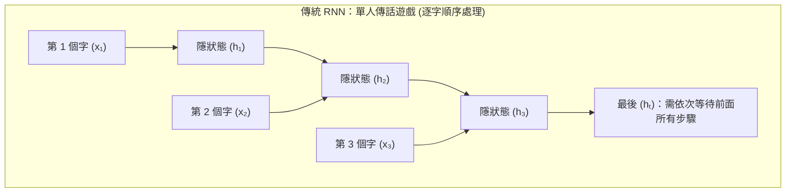

### 白話解讀：RNN 就像「單人傳話遊戲」

想像你在玩傳話遊戲，第 1 個人把看到的訊息傳給第 2 個人，第 2 個人再結合第 2 個字的資訊傳給第 3 個人……
這種架構存在兩個致命問題：

1. **採循序計算（Sequential Processing），時間複雜度高且無法平行化**
   - **問題是什麼：** 計算第 $t$ 個時間步（Time Step）的隱狀態 $h_t$，必須先拿到第 $t-1$ 個時間步的 $h_{t-1}$。
     $$h_t = f(h_{t-1}, x_t; \Theta)$$
   - **為什麼糟糕：** 現代顯示卡（GPU）擅長的是「同時做幾萬個獨立的數學乘法（平行運算）」。但 RNN 必須「一步接一步」等待，就像排隊蓋章一樣，即使 GPU 有 10,000 個核心，也只能用 1 個核心慢慢算，硬體利用率極低。

2. **梯度消失（Vanishing Gradient）與長期依賴（Long-term Dependencies）衰減**
   - **問題是什麼：** 傳話傳到第 100 個人時，第一個人的話早就被忘得差不多了，甚至傳遞過程中訊息被扭曲失真。
   - **數學本質：** 在反向傳播（BPTT）計算梯度時，長度為 $T$ 的序列會引發矩陣的連乘：
     $$\frac{\partial h_T}{\partial h_1} = \prod_{t=2}^T \frac{\partial h_t}{\partial h_{t-1}}$$
     若連乘的矩陣特徵值小於 1，梯度會呈指數級衰減至 0。
   - **資訊瓶頸（Information Bottleneck）：** RNN 強制將整本書或長篇文章的所有語意，硬生生塞進一個固定大小的向量 $h_T$ 中，導致早期資訊不可逆地丟失。

---

## 1.2 Transformer 的突破（2017《Attention Is All You Need》）

Google 團隊在 2017 年發表的論文《Attention Is All You Need》中提出了 **Transformer** 架構，徹底推翻了 RNN 的設計邏輯。

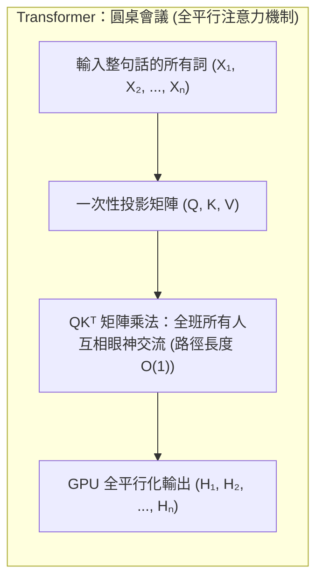

### 白話解讀：Transformer 就像「圓桌會議」

Transformer 不再逐字傳話，而是把整篇文章的所有單詞**一次性**搬到一張大圓桌上。每個人（Token）都可以**同時**看向圓桌上的其他所有人，並直接評估自己跟其他人的關聯程度。

### 關鍵創新點拆解

1. **徹底捨棄 Recurrence（循環）與 Convolution（卷積）**
   - 不再使用遞迴迴圈，完全依賴**自注意力機制（Self-Attention）**來建立單詞之間的關係。

2. **$O(1)$ 的任意長度資訊互動路徑**
   - 無論第一個單詞與第 1000 個單詞相距多遠，它們在 Self-Attention 矩陣中都是**直接相連**的，只需一步計算即可互相傳遞資訊，完美解決了長距離記憶衰減問題。

3. **GPU 極致平行訓練（Parallel Training）**
   - 整個序列的注意力計算轉換為大規模矩陣乘法（$QK^T$），GPU 所有核心可以同時滿載運算，訓練速度提升數十倍至數百倍。

---

## 1.3 核心概念名詞對照表

為了讓讀者無障礙閱讀後續章節，以下整理了筆記中會頻繁出現的核心術語表：

| 專有名詞 | 英文全稱 | 白話通俗解釋 |
| :--- | :--- | :--- |
| **Token** | Token / Word Piece | 模型處理的最基本文字單位（可以是一個單詞、字詞碎片或標點符號）。 |
| **Sequence Length ($N$ 或 $L$)** | Sequence Length | 輸入文字的序列長度（例如一句話包含 32 個 Token，則 $L=32$）。 |
| **Embedding** | Embedding / Vector | 將文字 Token 轉化為一串包含語意特徵的浮點數數字向量。 |
| **Dimension ($d_{\text{model}}$)** | Model Dimension | 模型中每個 Token 向量的維度長度（如 512, 4096，維度越高語意越豐富）。 |
| **Self-Attention** | Self-Attention | 句子內部的單詞自己跟自己句子裡的其他單詞計算相關性。 |
| **Gradient** | Gradient | 模型學習時用來調整參數方向與大小的「方向指南針」。 |

---

## 1.4 序列模型比較表

下表對比了不同序列層結構在計算性能上的差異（設 $N$ 為序列長度，$d$ 為特徵維度，$k$ 為卷積核大小）：

| 結構類型 (Layer Type) | 每層計算複雜度 (Complexity per Layer) | 順序操作數 (Sequential Operations) | 最大路徑長度 (Maximum Path Length) | 平行化能力 (Parallelization) |
| :--- | :--- | :--- | :--- | :--- |
| **Recurrent (RNN/LSTM)** | $O(N \cdot d^2)$ | $O(N)$（需等待 $N$ 步） | $O(N)$（長距離易遺忘） | ❌ 差（嚴格順序） |
| **Convolutional (1D CNN)** | $O(k \cdot N \cdot d^2)$ | $O(1)$ | $O(\log_k(N))$ | 100% 佳（視窗平行） |
| **Self-Attention (Transformer)** | $O(N^2 \cdot d)$ | $O(1)$（一步到位） | $O(1)$（任意距離直接互動） | 💯 極佳（矩陣平行） |

---

# 第 2 章：輸入層（Input Layer）與位置感知

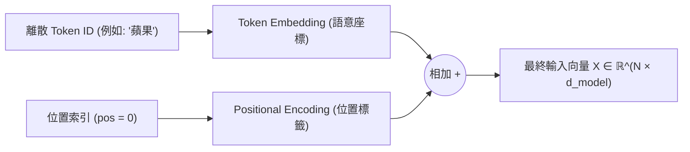

## 2.1 詞嵌入（Token Embeddings）

### 白話解讀：將單詞定位在「多維語意地圖」上

電腦不懂文字，只懂數字。
1. **離散映射：** 詞嵌入矩陣 $E_{\text{token}} \in \mathbb{R}^{|V| \times d_{\text{model}}}$ 就像一本字典，把詞表中的每個 Token ID（如 `蘋果` $\to$ ID 4521）查表轉換為一個長度為 $d_{\text{model}}$（例如 4096 維）的連續數字向量。
2. **語意距離：** 在這個高維空間中，「蘋果」和「香蕉」的向量距離會非常近，而「蘋果」和「飛機」的距離會很遠。

### 為什麼原始 Transformer 要把 Embedding 乘以 $\sqrt{d_{\text{model}}}$？
- **直觀解釋：** 初始化 Embedding 時，向量數值通常很小（方差接近 1）。如果直接加上位置編碼向量，位置資訊的數值會比語意資訊大很多，導致「語意被位置淹沒」。乘以 $\sqrt{d_{\text{model}}}$（如 $\sqrt{512} \approx 22.6$）可以把語意向量的能量放大，讓語意與位置資訊達成平衡。

---

## 2.2 位置編碼（Positional Encoding, PE）

### 1. 問題成因：置換不變性（Permutation Invariance）

#### 白話解讀：為什麼打碎句子對 Transformer 無感？
Self-Attention 計算的是單詞之間的**兩兩點積相似度**。
如果把句子「貓 吃 魚」打亂變成「魚 吃 貓」，若沒有位置編碼：
- 「貓」與「吃」的點積數值完全不會變。
- 「魚」與「吃」的點積數值也完全不會變。

對注意力矩陣來說，這兩句話的計算結果**完全一模一樣**！這叫做「置換不變性」。因此，我們必須主動把「單詞在句子裡的順序/位置」告訴模型。

---

### 2. 正弦/餘弦絕對位置編碼（Sinusoidal Positional Encoding）

原始 Transformer 採用固定且無須學習的三角函數位置編碼，公式如下：

$$\text{PE}_{(pos, 2i)} = \sin\left(\frac{pos}{10000^{\frac{2i}{d_{\text{model}}}}}\right)$$

$$\text{PE}_{(pos, 2i+1)} = \cos\left(\frac{pos}{10000^{\frac{2i}{d_{\text{model}}}}}\right)$$

#### 白話符號拆解
* $pos$：該單詞在句子中的**排隊位置**（第 0 個字、第 1 個字……）。
* $i$：向量維度的**通道號**（第 0 維、第 1 維……直到 $d_{\text{model}}/2$）。
* $10000^{\frac{2i}{d_{\text{model}}}}$：控制波長/頻率的常數。

#### 💡 直觀比喻：像時鐘的「秒針、分針、時針」
* **低維度通道（$i$ 很小）：** 頻率極高（像秒針），數字隨位置變化劇烈，用來精準分辨**相鄰的單詞**（如語法結構）。
* **高維度通道（$i$ 很大）：** 頻率極低（像時針），數字隨位置變化非常緩慢，用來識別**長距離的大致位置**（如篇章開頭或結尾）。

#### 數學優勢：相對位置的線性變換性質
為什麼要交替使用 $\sin$ 和 $\cos$？因為根據三角函數積化和差公式，對於任意固定距離 $k$：

$$\begin{pmatrix} \text{PE}_{(pos+k, 2i)} \\ \text{PE}_{(pos+k, 2i+1)} \end{pmatrix} = \begin{pmatrix} \cos(\omega_i k) & \sin(\omega_i k) \\ -\sin(\omega_i k) & \cos(\omega_i k) \end{pmatrix} \begin{pmatrix} \text{PE}_{(pos, 2i)} \\ \text{PE}_{(pos, 2i+1)} \end{pmatrix}$$

**這意味著：** 位置 $pos+k$ 的編碼可以用位置 $pos$ 的編碼經過一個**固定旋轉矩陣**直接算出來。模型非常容易學會「單詞 A 和單詞 B 相距 3 個位置」這種相對距離關係。

---

## 2.3 現代位置編碼演進

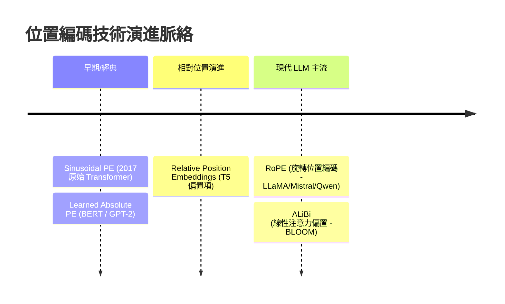

### 1. 可學習絕對位置編碼（Learned Positional Embeddings）
* **代表：** BERT, GPT-2, GPT-3。
* **白話概念：** 不用三角函數公式，直接隨機初始化一張表格 $N_{\text{max}} \times d_{\text{model}}$，讓模型在訓練時自己去學習每個位置的向量。
* **致命缺點（缺乏外推性）：** 如果訓練時表格只設了 2048 個位置，推理時傳入 2049 個單詞，模型就會因為查不到第 2049 行的表格而直接報錯崩潰！

### 2. 旋轉位置編碼（RoPE, Rotary Position Embedding）
* **代表：** LLaMA 1/2/3, Mistral, Qwen 1.5/2.5, PaLM。
* **白話概念：像二維向量上的「角度旋轉」**
  RoPE 不在 Embedding 上加數字，而是在計算 Query 和 Key 時，把向量放在複數平面上，**根據 Token 的位置 $m$ 把它旋轉一個角度 $m\theta$**。
* **數學推導（2D 平面）：**
  對於位置 $m$ 的向量 $\mathbf{x}_m \in \mathbb{R}^2$，旋轉矩陣 $\mathbf{R}_{\Theta, m}^2$ 定義為：
  $$\mathbf{R}_{\Theta, m}^2 \mathbf{x}_m = \begin{pmatrix} \cos m\theta & -\sin m\theta \\ \sin m\theta & \cos m\theta \end{pmatrix} \begin{pmatrix} x_{m,1} \\ x_{m,2} \end{pmatrix}$$
* **為什麼神奇？內積自帶相對位置：**
  當位置 $m$ 的 Query $\mathbf{q}_m$ 與位置 $n$ 的 Key $\mathbf{k}_n$ 計算點積時：
  $$\langle \mathbf{R}_{\Theta, m} \mathbf{q}_m, \mathbf{R}_{\Theta, n} \mathbf{k}_n \rangle = \mathbf{q}_m^T \mathbf{R}_{\Theta, n-m} \mathbf{k}_n$$
  點積結果**只取決於相對距離 $(n - m)$**（即兩者指針旋轉角度的差值）！這讓 RoPE 具備極強的長文本外推能力（如 RoPE 內插法擴展上下文）。

### 3. ALiBi（Attention with Linear Biases）
* **代表：** BLOOM, MPT。
* **白話概念：距離越遠，聲音越小（加上距離懲罰）**
  ALiBi 徹底省去位置向量，直接在計算 Attention Score 時加一個距離懲罰項：
  $$A_{i,j} = \frac{\mathbf{q}_i \mathbf{k}_j^T}{\sqrt{d_k}} - m \cdot |i - j|$$
  距離 $|i - j|$ 越大，扣的分數越多（$m$ 為超參數）。短文本訓練後可直接無縫外推至長文本。

---

## ⚠️ 觀念釐清：正弦/餘弦絕對位置編碼 (Sinusoidal PE) $\neq$ 旋轉位置編碼 (RoPE)

讀者常因這兩種技術都使用了正弦（$\sin$）與餘弦（$\cos$）函數而產生混淆。**事實上，它們是兩種完全不同的技術！**

### 核心區別與演進對比

| 對比項目 | 正弦/餘弦絕對位置編碼 (Sinusoidal PE) | 旋轉位置編碼 (RoPE) |
| :--- | :--- | :--- |
| **首創年份與論文** | 2017《Attention Is All You Need》(Google) | 2021《RoFormer》(Jianlin Su et al.) |
| **編碼屬性** | **絕對位置編碼**（標註各字在第幾格） | **相對位置編碼**（透過角度旋轉算出距離） |
| **作用位置** | **最底層的輸入層 (Embedding)** | **注意力機制內的 Query ($Q$) 與 Key ($K$)** |
| **數學操作** | **向量直接相加**：$X_{\text{final}} = X_{\text{embed}} + \text{PE}_{pos}$ | **矩陣旋轉相乘**：$\mathbf{q}_m' = \mathbf{R}_{\Theta, m} \mathbf{q}_m, \ \mathbf{k}_n' = \mathbf{R}_{\Theta, n} \mathbf{k}_n$ |
| **$\sin/\cos$ 的用途** | 用來**生成固定的位置特徵向量**。 | 填在**旋轉矩陣 $\mathbf{R}_{\Theta, m}$ 內部**作為旋轉角度。 |
| **代表模型** | 原始 Transformer | **LLaMA-1/2/3, Qwen-2.5, Mistral, DeepSeek** |

### 💡 白話總結差別
- **Sinusoidal PE（直接加進去）：** 像是在文字 Embedding 身上印上一串帶有 $\sin/\cos$ 紋理的衣服。
- **RoPE（拿去旋轉 $Q$ 和 $K$）：** 像是在計算相似度時，把 $Q$ 指針和 $K$ 指針在鐘面上記據位置旋轉一個角度，**點積內積時角度相減 $(m-n)$ 自然得到相對距離！**

---

# 第 3 章：注意力機制與現代變體（MHA / MQA / GQA / MLA）

## 3.1 Q / K / V 概念映射

### 💡 核心比喻：圖書館搜尋系統

注意力機制的本質可以抽象化為一個**軟性字典檢索（Soft Database Lookup）系統**。

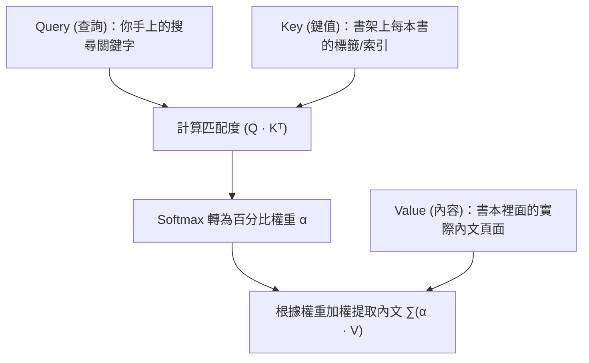

* **Query ($Q$)：** 當前單詞「想要尋找什麼樣的上下文特徵」。
* **Key ($K$)：** 其他單詞「具備什麼樣的標籤特徵」以供匹配。
* **Value ($V$)：** 匹配成功後，實際要被提取並傳遞下去的「語意資訊內容」。

---

## 🔍 實例演算 1：模型是如何「解讀文字與消除歧義」的？

為了讓抽象的 Attention 計算更加直觀，我們來看一個具體的文字解讀範例。

### 📌 測試句子
> **「蘋果 發表了 新的 手機，它 具備 強大的 晶片」**

當模型讀到句子後半段的代名詞 **「它」** 時，模型該如何知道「它」指的是「蘋果公司」還是「手機」？

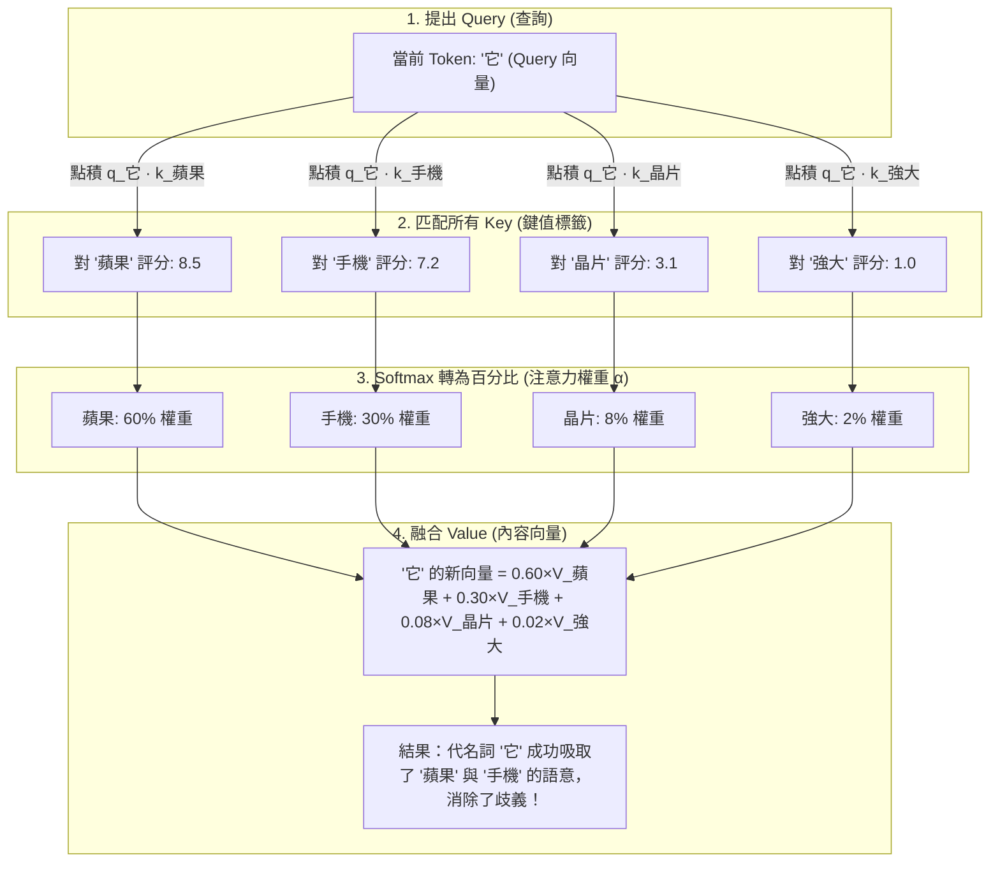

### 💡 雙向上下文解讀的多義詞例子
再比較以下兩句話中的「蘋果」：
1. **句子 A：** 「這顆 **蘋果** 採摘於 樹上，咬起來 很 甜。」
   - 「蘋果」的 Query 向量與「樹上」、「甜」、「採摘」的 Key 向量點積得分極高。
   - **解讀結果：** 「蘋果」吸收了農業/水果特徵，被理解為 **水果**。
2. **句子 B：** 「**蘋果** 發表了 新的 iPhone 與 Mac 晶片。」
   - 「蘋果」的 Query 向量與「發表」、「iPhone」、「Mac」的 Key 向量點積得分極高。
   - **解讀結果：** 「蘋果」吸收了科技/公司特徵，被理解為 **科技公司**。

這就是 Self-Attention **「解讀文字、消解多義詞」** 的真實運作過程！

---

## 3.2 縮放點積注意力（Scaled Dot-Product Attention）

數學公式如下：

$$\text{Attention}(Q, K, V) = \text{softmax}\left(\frac{QK^T}{\sqrt{d_k}}\right)V$$

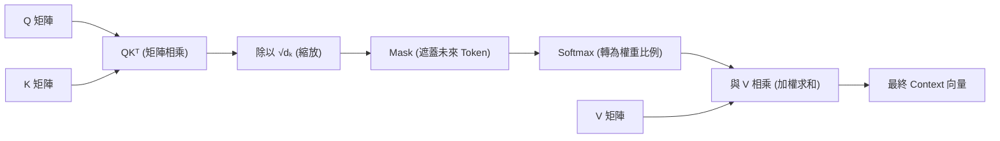

### 白話計算步驟拆解

1. **$QK^T$（點積匹配）：** 用長度為 $N$ 的 Query 與長度為 $M$ 的 Key 做矩陣乘法，算出兩兩之間的原始匹配得分矩陣（維度 $N \times M$）。
2. **除以 $\sqrt{d_k}$（縮放）：** 防止得分過大導致 Softmax 壞掉。
3. **Masking（遮蓋）：** 將非法位置（如 Padding 補零處或未來單詞）設為 $-\infty$。
4. **Softmax（比例化）：** 把每一行的得分轉化為加總為 1（100%）的機率比例分佈。
5. **與 $V$ 相乘（加權提取）：** 根據機率比例對 Value 向量進行加權求和，輸出最終的上下文語意向量。

---

### 🔍 關鍵證明：為何一定要除以 $\sqrt{d_k}$？

#### 白話解釋：避免「聲音太尖銳導致 Softmax 一言堂」
假設未經過縮放，當特徵維度 $d_k$ 很長（例如 $d_k = 128$）時，點積結果的動態範圍會變得極大。如果某個點積算出 100 分，另一個算出 10 分：
- $\text{Softmax}([100, 10]) \approx [1.0, 0.0]$
- Softmax 輸出會瞬間變成「One-Hot 獨裁分佈」（除了最高分給 100% 權重外，其餘全給 0%）。
- **致命後果（梯度飽和）：** 當 Softmax 輸入極端時，其導函數 $\text{Softmax}'(z) \to 0$，反向傳播時**梯度會化為 0（梯度消失）**，模型徹底停止學習！

#### 數學推導
假設 $q_i, k_i$ 為均值為 0、變異數為 1 的獨立隨機變數：
$$\mathbb{E}[q_i] = 0, \quad \text{Var}(q_i) = 1$$
$$\mathbb{E}[k_i] = 0, \quad \text{Var}(k_i) = 1$$

點積 $q \cdot k = \sum_{i=1}^{d_k} q_i k_i$ 的變異數為：
$$\text{Var}(q \cdot k) = \sum_{i=1}^{d_k} \text{Var}(q_i k_i) = \sum_{i=1}^{d_k} 1 = d_k$$

點積的標準差（Standard Deviation）為 $\sqrt{d_k}$。
因此，將點積**除以 $\sqrt{d_k}$**，就能將其變異數重新拉回 1：
$$\text{Var}\left(\frac{q \cdot k}{\sqrt{d_k}}\right) = \frac{\text{Var}(q \cdot k)}{d_k} = \frac{d_k}{d_k} = 1$$
從而確保 Softmax 在高維度下依然擁有平滑的梯度。

---

## 3.3 多頭注意力（Multi-Head Attention, MHA）

### 白話解讀：多個專家從不同視角看問題

單一注意力機制只能專注於一種關聯（例如「主詞與動詞」）。
多頭注意力（Multi-Head Attention）將特徵維度拆分成 $h$ 個獨立的低維子空間（如 8 個頭）：
- **Head 1：** 專注於指稱關係（「它」指的是「蘋果」還是「公司」）。
- **Head 2：** 專注於時態與語法結構。
- **Head 3：** 專注於長距離情緒關聯。

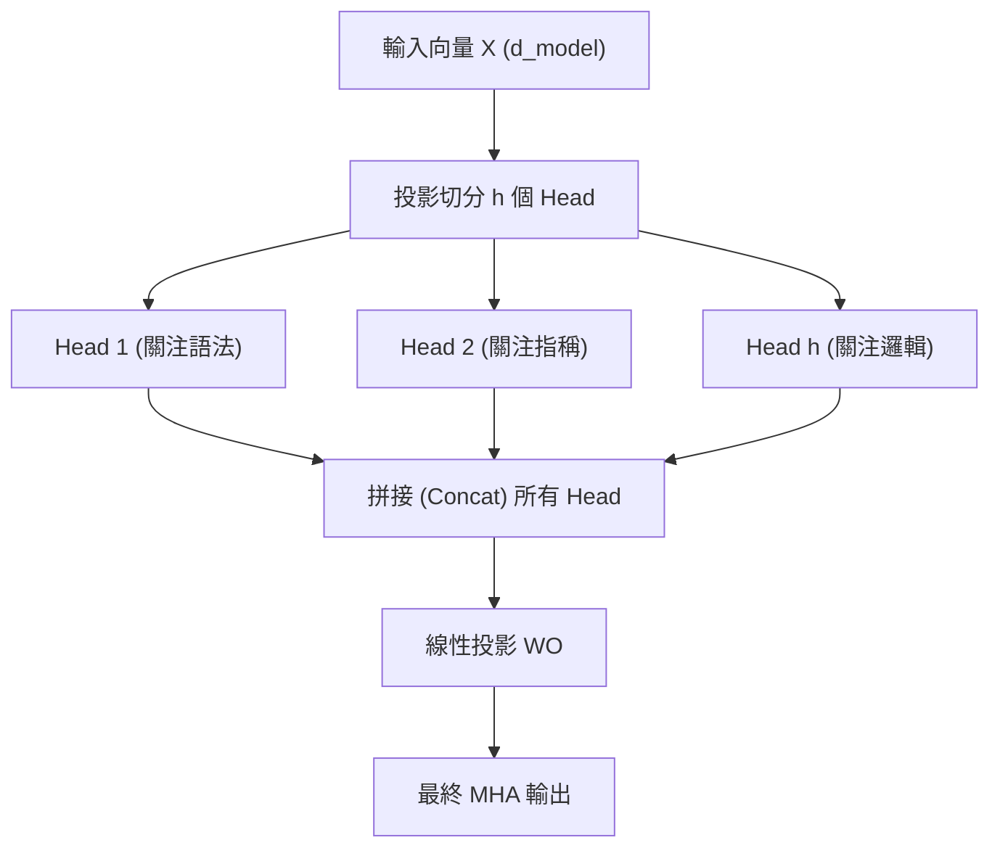

---

## 3.4 現代注意力優化演進（MHA $\to$ MQA $\to$ GQA $\to$ MLA）

在 LLM 推理生成（Autoregressive Inference）時，最大的效能瓶頸是**KV Cache（鍵值快取）佔用大量顯示記憶體（顯存）與頻寬**。為了解決這個問題，業界經歷了四代注意力結構演進：

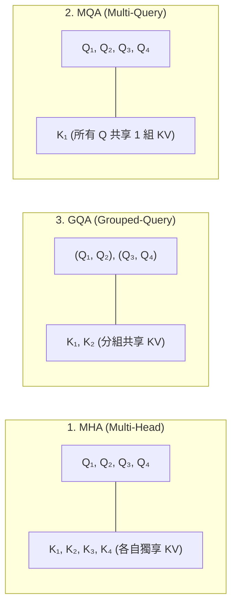

### 1. MHA (Multi-Head Attention)
- **結構：** 有 $h$ 個 Q 頭，就有 $h$ 個 K 頭與 $h$ 個 V 頭。
- **優缺點：** 表達能力最強，但推論時 KV Cache 顯存佔用極大，容易造成顯存不夠（OOM）。

### 2. MQA (Multi-Query Attention)
- **結構：** 有 $h$ 個 Q 頭，但**所有 Q 頭共用同一組 K 與 V**！
- **優缺點：** KV Cache 顯存需求驟降 $90\%$ 以上，推論速度極快；但模型容量受到壓縮，複雜推理能力有微幅損失。

### 3. GQA (Grouped-Query Attention) - 現代大模型黃金標準
- **代表：** LLaMA-2 (70B), LLaMA-3, Mistral, Qwen-2.5。
- **結構：** 折衷設計。將 $h$ 個 Q 頭分成 $g$ 個小組，**每一組內的 Q 頭共享一組 K 和 V**。
- **優劣勢：** 完美平衡推理速度與模型表現，性能幾乎媲美 MHA，速度接近 MQA。

---

### 4. MLA (Multi-Head Latent Attention) - DeepSeek-V2/V3 核心創新

**MLA（多頭潛在注意力）** 是由 **DeepSeek 團隊（DeepSeek-V2 / DeepSeek-V3 / DeepSeek-R1）** 研發的核心創新注意力架構。它被譽為當前 LLM 注意力機制設計的集大成者。

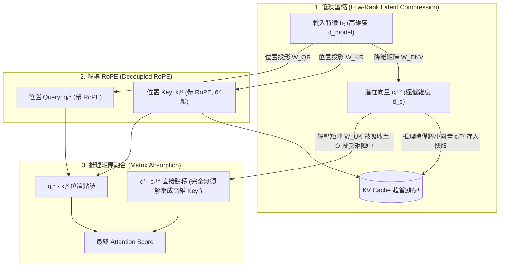

#### 1. 核心痛點：GQA 的極限與 MLA 的創舉
- **GQA 的局限：** GQA 透過將多個 Q 頭共享同一組 KV 來省顯存，但這強制降低了 Key/Value 的**頭數多樣性（Key/Value Head Density）**。
- **MLA 的終極目標：** 能不能**不砍 KV 頭數（維持像 MHA 一樣的 128 個 Head）**，卻比 GQA 省下更多顯存？答案就是**低秩潛在空間壓縮 (Low-Rank Compression)**。

---

#### 2. 核心原理一：低秩矩陣壓縮 (Low-Rank Compression)

MLA 不直接儲存每個 Head 的高維 Key 與 Value，而是把所有 Head 的 Key 和 Value **共同壓縮為一個長度極小的潛在向量（Compressed Latent Vector $c_t^{KV}$）**：

$$c_t^{KV} = W^{DKV} h_t$$

* $h_t \in \mathbb{R}^{d_{\text{model}}}$：輸入 Token 的原始高維特徵。
* $W^{DKV} \in \mathbb{R}^{d_c \times d_{\text{model}}}$：低秩降維投影矩陣。
* $c_t^{KV} \in \mathbb{R}^{d_c}$：壓縮後的潛在向量，維度 $d_c$（如 512）遠小於傳統所有 Head KV 相加的總維度（如 $128 \times 128 = 16,384$）。

在計算 Attention 時，再透過升維解壓矩陣 $W^{UK}$ 和 $W^{UV}$ 還原出各個 Head 的 Key 與 Value：

$$k_{t,i}^C = W_i^{UK} c_t^{KV}, \quad v_{t,i}^C = W_i^{UV} c_t^{KV}$$

**推論快取的奇蹟：** 在 KV Cache 中，每個 Token **只需儲存這個小小的 $c_t^{KV}$ 向量**！

---

#### 3. 核心原理二：解決 RoPE 衝突 —— 解耦 RoPE (Decoupled RoPE)

##### 💥 遇到技術大山：RoPE 無法被矩陣吸收
如果在壓縮後的 Key 向量上直接施加 RoPE 旋轉位置編碼 $\mathbf{R}_{\Theta, t}$，由於 $\mathbf{R}_{\Theta, t}$ 是位置相關的動態矩陣，它會挾在解壓矩陣 $W^{UK}$ 中間，導致在推論時**無法將解壓矩陣提前融合到 Query 投影矩陣中**！

##### 💡 DeepSeek 的天才解答：把「語意」與「位置」一拆為二
DeepSeek 將 Key 和 Query 拆成兩個獨立部分：
1. **內容分量（Content Key $k_t^C$）：** 從潛在向量 $c_t^{KV}$ 解壓而來，只包含純語意特徵，**不施加 RoPE**！
2. **位置分量（Position Key $k_t^R$）：** 維度極小（如 $d_h^R = 64$），專門用來**施加 RoPE 旋轉位置編碼**。

最終的注意力匹配得分為語意得分與位置得分的**直接相加**：

$$\text{Score}_{t, j} = \underbrace{q_{t, i}^C (k_{j, i}^C)^T}_{\text{純語意匹配 (可進行矩陣融合)}} + \underbrace{q_{t, i}^R (k_{j}^R)^T}_{\text{RoPE 位置匹配}}$$

---

#### 4. 核心原理三：推論階段的黑科技 —— 矩陣吸收/融合 (Matrix Absorption)

在生成推理（Inference）階段，MLA 實現了驚人的計算優化：

$$q_{t, i}^C (k_{j, i}^C)^T = q_{t, i}^C (W_i^{UK} c_j^{KV})^T = \left( q_{t, i}^C W_i^{UK} \right) c_j^{KV}$$

* 在推論開始前，把解壓矩陣 $W_i^{UK}$ **直接乘在 Query 投影矩陣中**，融合為新的 $W_i'^Q$。
* **結果：** 推理時**完全不需要將 $c_j^{KV}$ 解壓還原成高維 $K$**！模型直接拿融合後的 Query 與快取中低維度的 $c_j^{KV}$ 進行點積運算！
* **極致效益：** 既省下了 90% 的 KV Cache 顯存，又省去了推論時解壓 Key 矩陣的 FLOPs 計算耗時！

---

### 🔍 實例演算 5：DeepSeek MLA 壓縮與推論計算全流程實例

為了讓讀者徹底看懂 MLA 的神妙之處，我們帶入具體維度數字走一遍流程：

#### 📌 假設場景與參數設定
- **模型維度：** $d_{\text{model}} = 4096$
- **注意力頭數：** 滿血 $n_h = 128$ 個 Head，每個 Head 維度 $d_h = 128$
- **MLA 壓縮潛在維度：** $d_c = 512$
- **位置向量維度：** $d_h^R = 64$

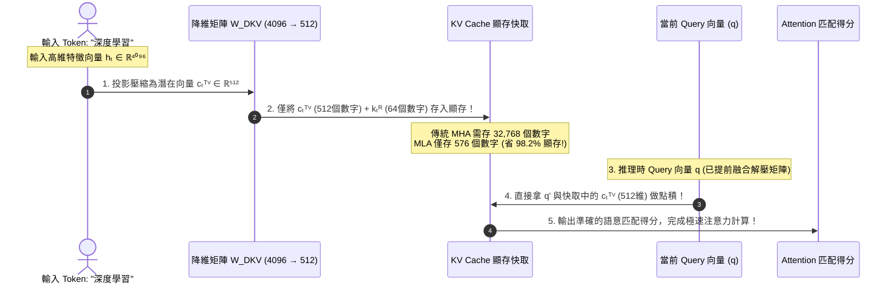

#### 💡 效果總結
1. **儲存階段：** 顯存只存了 **576 個浮點數**（$512$ 維語意 $+ 64$ 維 RoPE 位置）。
2. **計算階段：** 藉由矩陣吸收，模型**完全不需要把 512 維還原成 16,384 維**，在維持 128 個 Head 滿血精度的同時，實現了極致的推理吞吐量（Throughput）！

---

## 3.5 四大注意力機制顯存開銷定量比較

以 **DeepSeek-V2 / V3 典型參數**進行精確計算：
* 總頭數 $n_h = 128$，每個 Head 維度 $d_h = 128$（傳統總 KV 維度 $= 2 \times 128 \times 128 = 32,768$）
* MLA 潛在維度 $d_c = 512$，位置向量維度 $d_h^R = 64$

| 注意力結構 | 每個 Token 快取的浮點數數量 (KV Cache Size) | 相對 MHA 的顯存節省比例 | 語意頭數表達力 |
| :--- | :--- | :--- | :--- |
| **MHA (Multi-Head)** | $2 \times 128 \times 128 = \mathbf{32,768}$ | $0\%$ （基準，顯存極大） | 100% （滿血 128 頭） |
| **GQA (Grouped-Query, 8組)** | $2 \times 8 \times 128 = \mathbf{2,048}$ | 節省 $93.75\%$ | ⚠️ 頭數多樣性受到限制 |
| **MLA (Multi-Head Latent)** | $512 (\text{Latent}) + 64 (\text{RoPE}) = \mathbf{576}$ | **節省 $98.24\%$ (比 GQA 還小 3.5 倍!)** | 💯 **媲美滿血 MHA 128 頭** |

---

# 第 4 章：編碼器、解碼器與現代前饋網絡（SwiGLU / MoE）

## 4.1 Transformer 全局架構與流程

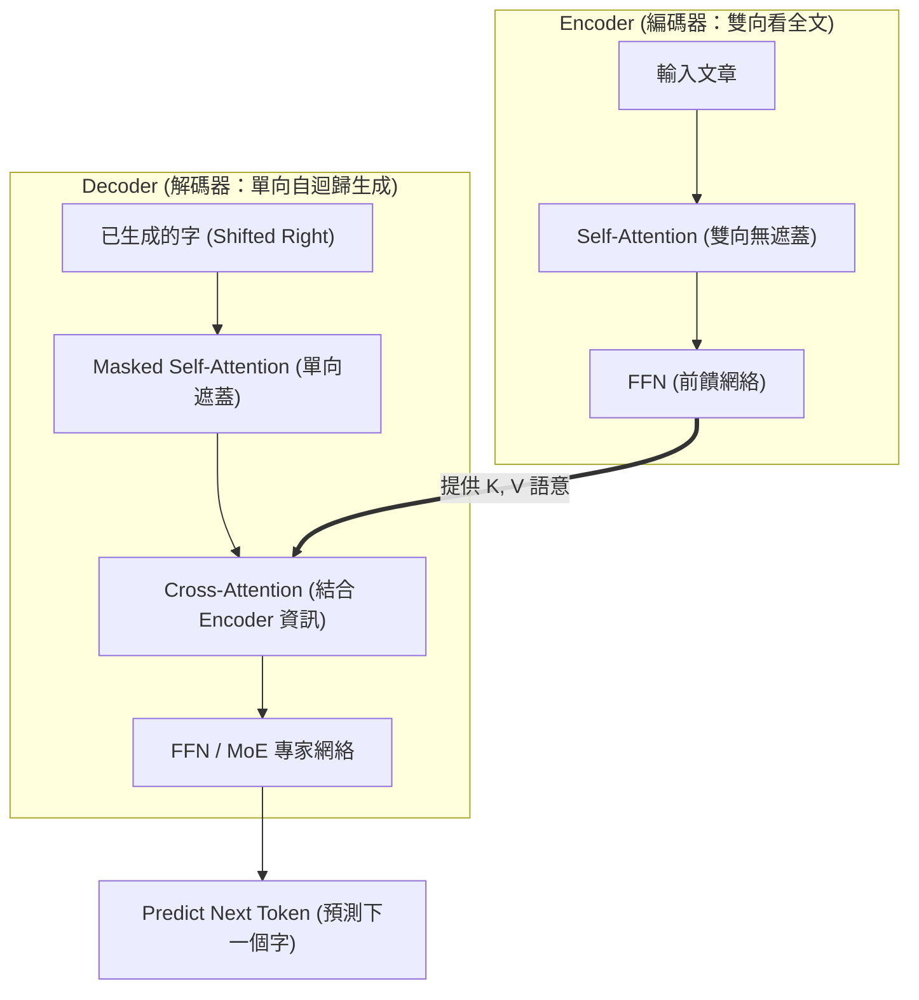

---

## 4.2 編碼器 vs 解碼器白話解讀

* **Encoder-only（雙向全看）：** 像在閱讀整篇已寫好的文章，前後單詞互相可見（如 BERT）。適合**文章理解、分類、搜尋**。
* **Decoder-only（單向自迴歸）：** 像在寫作文，看得到前面寫過的字，但**絕對不能偷看後面的字**（Causal Mask）。適合**生成文章、對話、寫程式碼**。
* **Encoder-Decoder（編碼+解碼）：** 先完整看懂源語言文章（Encoder），再逐字翻譯出目標語言（Decoder）。適合**機器翻譯（T5）**。

---

## 🔍 實例演算 2：LLM 大模型是如何「逐字生成文本（Autoregressive Generation）」的？

現在我們來看 GPT-4, LLaMA-3, ChatGPT 等 **Decoder-only** 模型是如何一步步回答問題並生成文本的。

### 📌 用戶輸入提示詞 (Prompt)
> **「人工智慧的 未來 是」**

模型的目標是接續這句話，**自迴歸（Autoregressive）** 逐字生成後續內容。

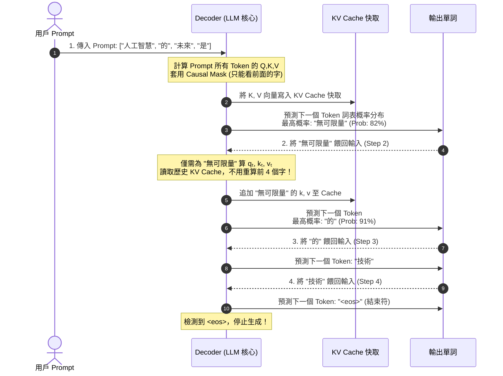

### 💡 關鍵機制：Causal Mask 下三角矩陣運算實例
在 Step 1 處理 `["人工智慧", "的", "未來", "是"]` 時，Mask 矩陣作用如下：

$$\text{Mask} = \begin{pmatrix} 
0 & -\infty & -\infty & -\infty \\
0 & 0 & -\infty & -\infty \\
0 & 0 & 0 & -\infty \\
0 & 0 & 0 & 0 
\end{pmatrix}$$

* 當計算第 1 個字 `人工智慧` 時，只看得到 `人工智慧`（其餘為 $-\infty$，Softmax 後概率為 0）。
* 當計算第 4 個字 `是` 時，看得到 `人工智慧`、`的`、`未來`、`是`，但**決不可能偷看到未來的生成字**！

---

## 🔍 實例演算 3：機器翻譯中的 Cross-Attention 實例

在 Seq2Seq 任務（如將英文翻譯為中文）中，Encoder-Decoder 模型的 **Cross-Attention** 子層如何工作？

### 📌 翻譯任務
> **英文源句 (Encoder)：** `The cat sat on the mat`
> **中文解碼 (Decoder)：** 準備生成 `貓`

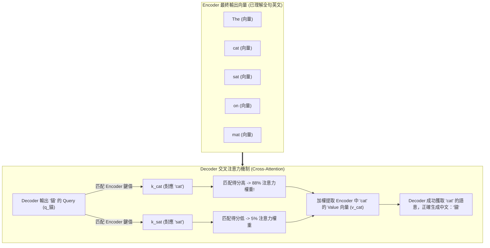

---

## 4.3 現代 FFN 與門控機制（SwiGLU）

在經典 Transformer 中，前饋神經網路（FFN）採用兩層線性投影加上 **ReLU** 激活函數：

$$\text{FFN}(x) = \max(0, x W_1 + b_1) W_2 + b_2$$

### 💡 現代演進：SwiGLU 門控機制

LLaMA, PaLM, Qwen 等現代 LLM 統一採用了 **SwiGLU (Swish-Gated Linear Unit)**：

$$\text{SwiGLU}(x) = \left( \text{Swish}(x W_g) \odot x W_1 \right) W_2$$

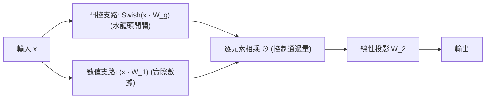

#### 白話解讀：就像一個「可調節的水龍頭開關（Gate）」
* 傳統 ReLU 只會簡單地把負數變成 0，正數保持原樣（粗暴的開或關）。
* SwiGLU 增加了一條「門控支路 $W_g$」，計算出一個 0 到 1 之間的動態比例。這個比例就像水龍頭一樣，能夠**動態控制**有多少資訊量可以通過 Value 支路。實驗證明門控機制能極大提升模型的學習能力。

---

## 4.4 混合專家模型（MoE, Mixture of Experts）

隨著模型參數暴增至數千億，若每一次計算都激活所有參數（Dense 模型），運算成本將不可接受。**MoE（混合專家模型）** 是現代超大模型（如 Mixtral 8x7B, DeepSeek-V3, GPT-4）的核心稀疏架構。

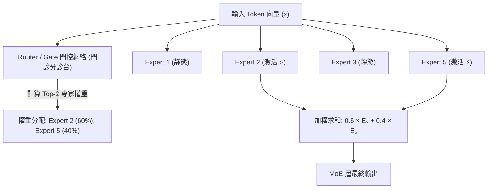

### 💡 核心比喻：醫院的「門診分診台」與「各科專科醫師」

* **Dense 模型（傳統）：** 每一個病人（Token）來了，都必須讓全醫院所有科別的醫生（100% 的參數）全部會診一遍，開銷極大。
* **MoE 模型（稀疏）：**
  1. 門口有一個聰明的**分診台（Router / Gate 網絡）**。
  2. 根據病人的症狀（Token 的語意特徵），從 8 位或 64 位**專科醫生（Experts 專家 FFN）**中，精準挑選出最合適的 **2 位專家（Top-2 Routing）** 進行看診。
  3. 雖然模型總參數極大（如 4700 億），但每個 Token 計算時只激活其中少部分參數（如 390 億），**實現了「超大容量」與「極速計算」兼得！**

---

## 🔍 實例演算 4：MoE 模型處理不同類型 Token 的專家分流實例

假設我們使用的是一個包含 8 個專家的 MoE 大模型（Top-2 路由），看模型如何處理一段包含**程式碼與人文歷史**的複合輸入：

### 📌 輸入語句
> **`"import torch\n巴黎 的 艾菲爾鐵塔"`**

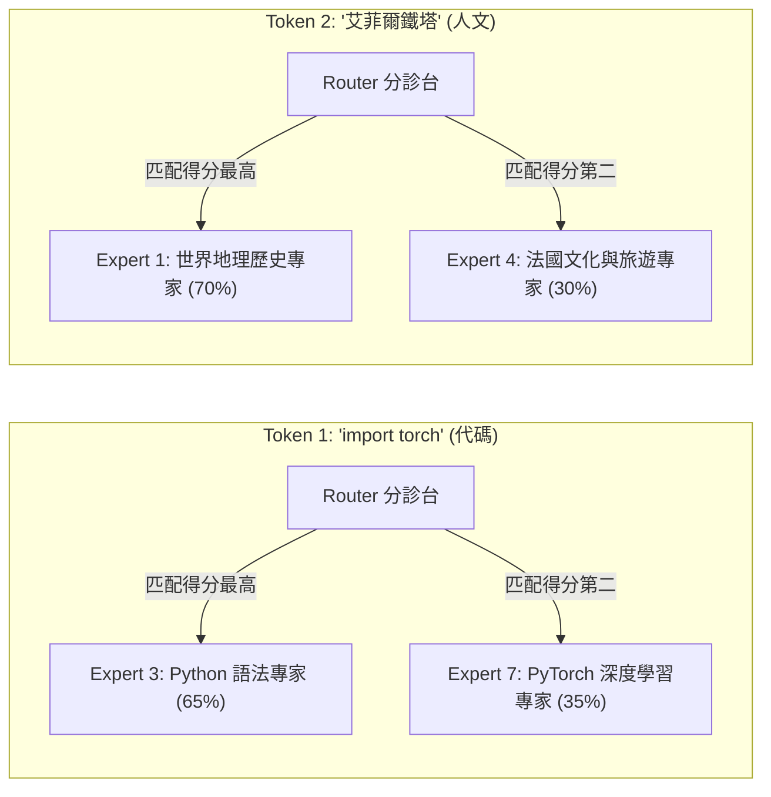

- **處理代碼 Token 時：** Router 自動將計算資源導向代碼與深度學習專家，完全不調用人文歷史專家。
- **處理地理 Token 時：** Router 自動將計算資源導向地理與文化專家。
- **結果：** 每個 Token 各取所需，計算量減少 75%，但專業深度達到頂級！

---

### 關鍵數學機制與公式

1. **路由概率計算（Routing Gate）：**
   Router 網絡是一個簡單的線性矩陣 $W_g$，計算 Token 選擇各個專家的得分：
   $$H(x) = \text{Softmax}(\text{KeepTopK}(x W_g, k))$$
   * $\text{KeepTopK}(v, k)$：保留前 $k$ 個最高得分，其餘設為 $-\infty$（使其 Softmax 後概率為 0）。

2. **專家輸出加權組合：**
   若選擇了前 $k$ 個專家，最終 MoE 層的輸出為被激活專家的加權求和：
   $$\text{MoE}(x) = \sum_{i \in \text{TopK}} H(x)_i \cdot \text{Expert}_i(x)$$

---

### ⚠️ 工程痛點與解決方案：負載均衡損失（Load Balancing Loss）

#### 痛點：明星專家過載，冷門專家「失業」
在訓練 MoE 時，Router 很容易產生偏見——它會發現某 2 位專家表現很好，於是把 99% 的 Token 都扔給這 2 位專家，導致其他專家完全得不到訓練（專家坍縮 Expert Collapse）。

#### 解決方案：輔助損失函數（Auxiliary Loss）
在總損失函數中加上一項**負載均衡懲罰項**：
$$\mathcal{L}_{\text{balance}} = \alpha \cdot N \cdot \sum_{i=1}^N f_i \cdot P_i$$
* $f_i$：分配給第 $i$ 個專家的 Token 比例。
* $P_i$：Router 預測給第 $i$ 個專家的概率比例。
* **效果：** 強制懲罰分配不均行為，確保所有專家都能均勻收到 Token 並得到充分訓練。

---

# 第 5 章：正規化與殘差結構（Residuals & Normalization）

## 5.1 殘差連接（Residual Connections）

```mermaid
flowchart LR
    X[輸入 x] --> SubLayer[複雜神經網路層 SubLayer(x)]
    X ---->|"快捷通道 (Identity Shortcut)"| Add((相加 +))
    SubLayer --> Add
    Add --> Out[輸出: x + SubLayer(x)]
```

### 💡 核心比喻：高科技傳送門

* **公式：** $x^{(l)} = x^{(l-1)} + \text{SubLayer}(x^{(l-1)})$
* **白話解讀：** 
  如果神經網路疊加到 100 層，梯度在反向傳播時經過 100 次連乘，很容易衰減到 0。
  殘差連接在神經網路旁邊開了一條**無阻礙的傳送門通道**。即使 `SubLayer` 什麼都沒學到（輸出 0），輸入 $x$ 也能 100% 原封不動地傳過去，保證深層網路絕對不會比淺層網路差，徹底解決了超深層網路難以訓練的問題。

---

## 5.2 層正規化（Layer Normalization, LayerNorm）

### 💡 白話比喻：全班單科排名 vs 單一學生個人平均

* **Batch Normalization (BatchNorm)：**
  針對同一個 Batch 裡的所有學生，計算大家在「數學這一科」的平均分與標準差進行歸一化。
  * **缺點：** 很依賴 Batch Size 的大小。如果是文字句子，每句話長短不一，BatchNorm 會算得亂七八糟。
* **Layer Normalization (LayerNorm)：**
  針對「單一學生個人」，計算他「自己所有考科」的平均分與標準差進行歸一化。
  * **優點：** 每個單詞/句子**獨立計算**，完全不依賴 Batch 大小或句子長度，非常適合 NLP。

$$\text{LayerNorm}(x) = \frac{x - \mu}{\sqrt{\sigma^2 + \epsilon}} \odot \gamma + \beta$$

---

## 5.3 結構位置演進：Post-LN vs Pre-LN vs RMSNorm

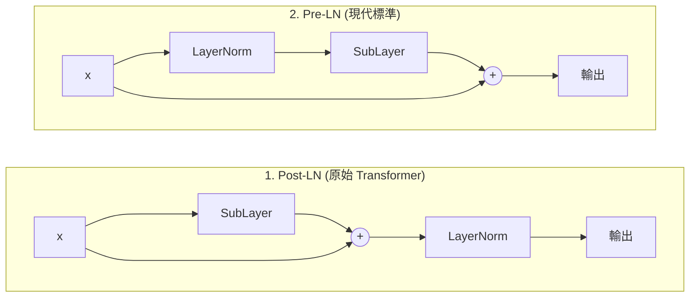

### 1. Post-LN（原始設計）
* **順序：** 先做 SubLayer 相加，最後做 LayerNorm。
* **痛點：** 殘差主幹上的數值會隨層數累積，導致梯度極不穩定，訓練時**必須搭配嚴格的 Warm-up（學習率慢速爬升）**，否則模型直接訓練崩潰。

### 2. Pre-LN（現代主流）
* **順序：** 先做 LayerNorm，再進入 SubLayer 計算。
* **優勢：** 殘差快捷通道保持「乾淨無阻礙」，梯度可以直接流到最底層，100+ 層的模型也能穩定收斂。

### 3. RMSNorm（Root Mean Square Normalization）
* **代表：** LLaMA 系列, Qwen, Mistral。
* **白話簡化：** 實驗發現 LayerNorm 效果好，是因為做了「除以標準差」的縮放，而「減去平均值 $\mu$」這一步根本不重要！
* **公式：**
  $$\text{RMSNorm}(x) = \frac{x}{\text{RMS}(x)} \odot \gamma, \quad \text{RMS}(x) = \sqrt{\frac{1}{d} \sum_{i=1}^d x_i^2 + \epsilon}$$
* **好處：** 省去計算平均值的步驟，直接省下 7% ~ 10% 的算子計算耗時。

---

# 第 6 章：架構演進與現代大模型家族

根據 Transformer 模組的不同組合與注意力遮罩機制，現代大模型分化為三大流派：

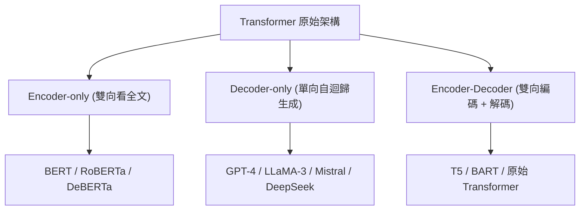

## 三大流派與現代大模型代表技術矩陣

| 類別 (Category) | 代表模型 (Models) | 注意力機制 (Attention) | FFN 門控與結構 | 歸一化層 (Norm) | 典型應用場景 |
| :--- | :--- | :--- | :--- | :--- | :--- |
| **Encoder-only** | BERT, RoBERTa | 雙向注意力（全可見） | 經典 FFN (GELU) | Post-LN / Pre-LN | 文本分類、標籤識別、語意向量檢索 |
| **Decoder-only (Dense)** | GPT-4, LLaMA-3, Qwen-2.5 | GQA + RoPE | SwiGLU | RMSNorm (Pre-LN) | 通用對話、寫程式碼、推理、文字生成 |
| **Decoder-only (MoE 稀疏)** | Mixtral 8x7B, DeepSeek-V3/R1 | GQA / MLA + RoPE | MoE (SwiGLU 專家 + Router) | RMSNorm | 兼具超高運算速度與千億級模型容量 |
| **Encoder-Decoder** | T5, BART | 雙向編碼 + 單向解碼 + Cross-Attn | 經典 FFN (ReLU/GELU) | Pre-LN | 機器翻譯、文章摘要整理 |

---

# 第 7 章：計算瓶頸與硬體層面的極致工程優化

## 7.1 時間與記憶體複雜度瓶頸

標準 Self-Attention 的計算與記憶體開銷隨序列長度 $L$ 呈**二次方暴漲（$O(L^2)$）**：

* **計算量（FLOPs）：** $O(L^2 \cdot d_{\text{model}})$
* **顯存佔用（Memory）：** $O(L^2)$（需在顯存中保存 $L \times L$ 的 Attention Score 矩陣以供反向傳播）

```
當上下文長度 L = 2,000  --> Score 矩陣元素數 ≈ 4,000,000
當上下文長度 L = 32,000 --> Score 矩陣元素數 ≈ 1,000,000,000 (暴增 256 倍！)
```

---

## 7.2 硬體層優化 1：FlashAttention（GPU 快取記憶體 IO 調度）

* **發明人：** Tri Dao (2022, 2023)

### 💡 核心比喻：桌面草稿紙 (SRAM) vs 遠處檔案櫃 (HBM)

* **GPU 的記憶體結構：**
  - **HBM（高頻寬顯存）：** 容量極大（80GB），但**讀寫速度慢**（像辦公室外面的檔案櫃）。
  - **SRAM（晶片內快取）：** 容量極小（20KB/SM），但**讀寫速度極快**（像你手邊的桌面草稿紙）。
* **傳統 Attention 為什麼慢：** 傳統計算每次算完 $QK^T$，就把 $L \times L$ 的大矩陣從桌面搬回遠處檔案櫃（HBM），要算 Softmax 時又從檔案櫃搬回桌面。**GPU 核心大部分時間都在「卡在搬運數據的路上（Memory IO-bound）」**！

```mermaid
flowchart TD
    subgraph Traditional ["1. 傳統 Attention：頻繁搬運 HBM (慢)"]
        HBM1[(HBM 顯存)] ==>|讀取 Q, K| SRAM1[SRAM 計算 QKᵀ]
        SRAM1 ==>|寫回 L×L 中間矩陣| HBM1
        HBM1 ==>|重新讀取矩陣| SRAM2[SRAM 計算 Softmax]
        SRAM2 ==>|寫回 Softmax 矩陣| HBM1
    end

    subgraph FlashAttn ["2. FlashAttention：切塊在 SRAM 內部算完 (快!)"]
        HBM_A[(HBM 顯存)] ==>|分塊 (Tiling) 載入| SRAM_A[SRAM 內部 Kernel 融合]
        SRAM_A -->|"Online Softmax 邊算邊累加 (不寫回 HBM)"| SRAM_A
        SRAM_A ==>|直接寫回最終結果| HBM_B[(HBM 顯存)]
    end
```

### FlashAttention 的三大硬體魔法

1. **Tiling（分塊技術）：** 把巨大的 $Q, K, V$ 切成剛好能放進 SRAM 桌面的小方塊（Block）。
2. **Online Softmax（線上歸一化）：** 在小方塊算完時，透過邊讀邊更新局部最大值與分母和的算法，**不需要一次性生成完整的 $L \times L$ 矩陣**！
3. **Recomputation（反向傳播重算）：** 反向傳播時不存 $L \times L$ 矩陣，而是直接重新算一遍小方塊，用微小的計算量換取巨大的顯存節省。
4. **結果：** 顯存佔用從 $O(L^2)$ 直降到 **$O(L)$**，推理與訓練速度提升 **2 ~ 4 倍**！

---

## 7.3 硬體層優化 2：PagedAttention (vLLM 記憶體分頁技術)

### 💡 核心比喻：作業系統的「記憶體分頁（Paging）」

在自迴歸生成時，隨著句子越來越長，KV Cache 佔用的顯存會動態增加。

```mermaid
flowchart TD
    subgraph TraditionalMem ["傳統 KV Cache (連續顯存分配)"]
        M1["已佔用 (Token 1~5)"] --- M2["預留空白 (浪費碎片)"] --- M3["已佔用 (Token 1~3)"]
    end

    subgraph PagedMem ["PagedAttention (分頁虛擬記憶體管理)"]
        V1["邏輯頁 Block 1"] -->|頁表 Mapping| P3["物理顯存塊 #3 (不連續物理位址)"]
        V2["邏輯頁 Block 2"] -->|頁表 Mapping| P1["物理顯存塊 #1"]
    end
```

* **傳統做法的痛點：** 為了防止顯存不夠，系統必須為每個請求提前預留一大塊**連續的顯存**。這導致顯存中充斥著大量無法被利用的「空白碎片（Fragmentation）」，顯存利用率常常低於 30%。
* **PagedAttention 機制：**
  引進作業系統管理電腦記憶體的分頁概念：將 KV Cache 拆成一個個固定大小的「Block 頁面（如 16 個 Token 頁）」。
  - 顯存物理位址可以**不連續**。
  - 透過一張「頁表（Page Table）」將邏輯 Token 映射到不連續的物理顯存塊。
  - **效果：** 將顯存浪費降低到接近 0%，模型併發處理量（Throughput）提升 **2 ~ 4 倍**！

---

## 7.4 演算法優化：Speculative Decoding (投機解碼 / 草稿解碼)

### 💡 核心比喻：實習生寫草稿，老教授一眼批改

大模型（Target Model，如 70B）生成 Token 時，每產生一個字都要將數百億參數載入 GPU 一次，速度極慢（受限於 Memory Bandwidth）。

```mermaid
flowchart LR
    Draft["小模型 (Draft Model, 如 1B)"] -->|"極速連寫 K 個草稿 Token (如 5 個字)"| Tokens["草稿 Token 序列 (t₁, t₂, t₃, t₄, t₅)"]
    Tokens --> Target["大模型 (Target Model, 70B)"]
    Target -->|"一次矩陣平行計算 (驗證 5 個字)"| Verify{"驗證結果"}
    Verify -->|"接受前 4 個字, 修改第 5 個字"| FastOut["一次成功生成 4 個字 (加速 2~3x!)"]
```

1. **小模型連寫草稿：** 讓一個極小、極快的草稿模型（Draft Model，如 1B 或 3B）迅速生成 $K$ 個 Token 的候選草稿。
2. **大模型平行驗證：** 大模型（70B）利用注意力矩陣的平行計算能力，**一次性驗證這 $K$ 個草稿 Token**。
3. **無損加速：** 只要驗證算法符合機率拒絕採樣（Rejection Sampling），生成結果在**數學上與大模型單獨逐字生成 100% 完全一致**，但生成速度直接提升 2 ~ 3 倍！
