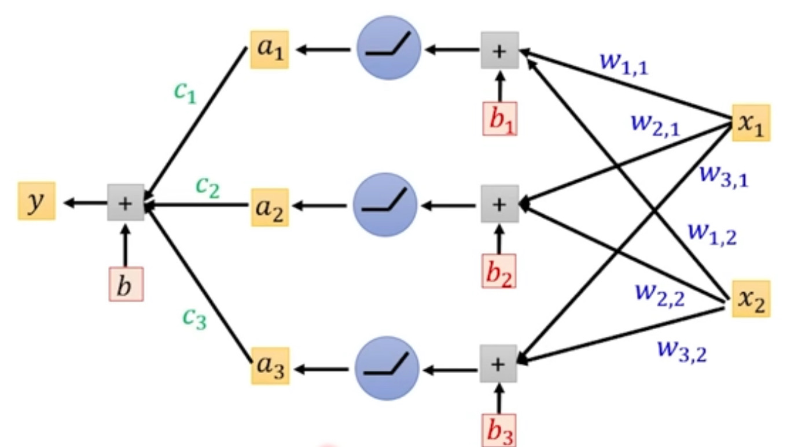
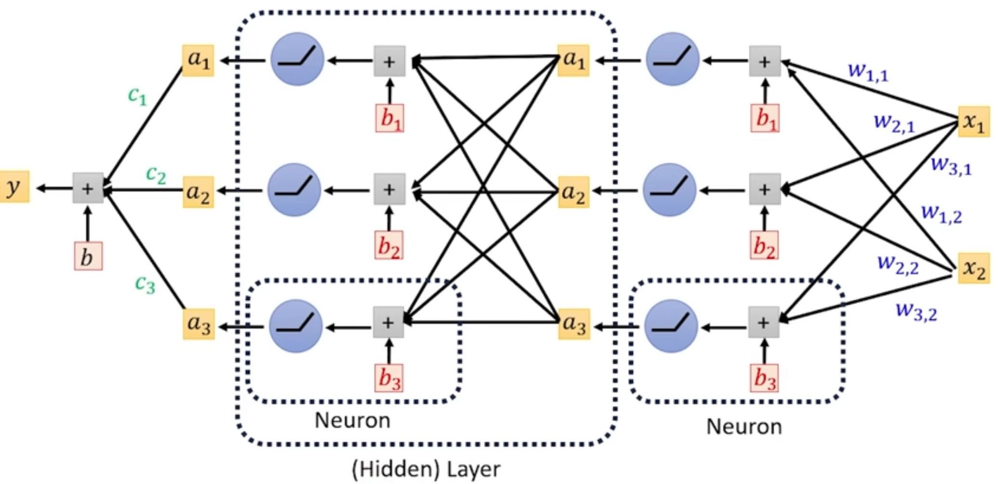

# 人工智慧與機器學習導論

## 生成原理

### 基本原理

語言模型本質上就是一種**文字接龍（Autoregressive Generation）**，

輸入一段文字，模型將其當作 prompt，進而生成下一個 token，再將此 token 餵回原先的 prompt 繼續生成下一個 token，

而在結束前會輸出一個帶俵終止的 token 以停止接龍

> 輸入 X1 進 f\(X\) \-\-\> 模型，模型得出 Y1 \-\-\> 結果，再把 Y1 加在 X1 後面形成 X2，以此類推，最終得到 Y end 結束

事實上語言模型輸出的是一個機率分布表，裡面有各個可能的 token 和其對應的機率，最終被輸出的 token 是用此機率擲骰子得到的，這也就是爲什麼語言模型遇到同個問題會有不一樣的回答（實際上會限定機率過低的 token 不被加入，以保證句子不會太怪）


- 語言模型可輸出的所有 token 的集合被稱為 vocabulary，往往非常巨大

- 其實不需擔心模型出現莫名其妙的答覆，因為奇怪答覆對應的 tolen 出現率ㄧ非常低

    ---

而語言模型需要有：

1. 語言知識（正確文法）：大量文章訓練，較容易

2. 知識（對世界的理解）：無窮無盡，較難

    ---

語言模型學習的資源來自：

1. 網路資料

2. 標注資料

3. 使用者回饋

    ---

- **為何會回答問題而不是給問句接龍？**

在使用者傳出問題後，使用者輸入後會被加上 **chat template**（標註輸入是使用者的問題，而後接上 Ai 的回答），讓模型專注於用回答的方式接龍，而不是單純把使用者的問句接下去

- **如何做到多輪對話？**

所有先前使用者與 Ai 的對話會被當作 prompt 連同下一個問題輸入給模型

- **為什麼會出現幻覺？**

因為是文字接龍，Ai 常常會回答出錯誤的答案，

確保輸入足夠的資訊（Context Engineering）或利用 RAG 來搜搜尋，

也可利用 System Prompt （開發者寫好的）來給予足夠資訊達成（使用者輸入的為 User Prompt）

- **如何生成圖片或聲音？**

以往利用像素點接龍或取樣點接龍，但會需要大量輸出，耗費巨量資源

現在常見的方法是將圖像或聲音利用編碼器壓縮轉換（同樣變為 token）

---

### 內部原理

#### 產生過程（簡化）

##### Tokenization

輸入被轉為 token（用 Embedding Table：查找模型的 Vocabulary 矩陣 （Embedding）

而轉換後對應到的這個向量稱 Token Embedding ，每個不同的 token 都會對應到自己的 Token Embedding


> 此矩陣（Matrix）就是模型參數（Parameters）

---

##### Layer by Layer

得到的 Token Embedding 再經過多層的矩陣進行轉換（變為 \(Contextualized\) Enbedding／\(Hidden\) Representation），而這種多層的結構稱為 Deep Learning（Neural Network，神經網路）

此轉換會考慮到當前 Representation 前面的所有 Representation 進行運算


> 平時所說的模型全中，包含了 Vocabulary 矩陣，也包含了 Layer by Layer 裡的矩陣

而內部不單單只是經過一層矩陣就直接輸出，裡面還有 Self\-attention Layer，再輸出 Feed，最後才變為 Representation

---

##### Self\-attention Layer

Attention Layer 的目的為：尋找引想當前 token 意思的其他 token ，並把這些有影響的 token 加在一起輸出


具體訓找分法是將 token 乘上一個向量得出數值（Attention Weight），在對其進行比對（通常也會經過 softmax 轉換為機率），

但也需要考慮到位置的關聯性（如利用 Positiion Emebedding），不然兩顆“青”蘋“果”跟“青”山上的“果”都會算出一樣的結果

接著把所有的 query 跟 key 和矩陣 Wv 相乘後相加起來，得出所有的總和，最後再加上 query，就是此 token 經過 

Attention Layer 的輸出（對於單一的 Attention）


而每一層  Attention Layer  裡面會有多層 Attention，產生的結果稱 Multi\-head Attention，分別對應不同性質的關聯性（如數量關係、形容詞關係）

所有的 Multi\-head Attention 再經過矩陣轉換矩陣轉換得出的才是最終的 Represntation


---

##### Q K V 向量

- Query 查詢：代表當前 token 正在尋找什麼樣的上下文資訊

    例如：找一本關於“蘋果”的“科技”書籍

- Key 鍵（索引，**被配對者**）：代表**此 token 具備什麼樣的特徵或屬性**，用來**跟別人的 Q 比對**

    例如：這本書的標籤是“水果、農業”，另一本書的標籤是“科技、電腦、蘋果公司”

- Value 值（內容向量，被配對者的真實資訊）：這個 Token **真正包含的底層語意資訊**

    ---

##### Attention 注意力機制（Q K V 計算）

$Q=XW_Q$

$K=XW_K$

$V=XW_V$ ，X 為矩陣（一個 token 為一個向量，組合成句子則變矩陣）W 為可學習的權重

$Attention\_weights=softmax(\frac{QK^T}{\sqrt{d_K}})$，softmax 函數轉換為機率

- 算出來的注意力權重代表模型在處理某 token 時，應該要分配多少比例的注意力在其他 token

- $K^T$的部分是進行轉置（N,d\_k）轉（d\_k,N），這樣才有辦法點積（內積），變為（N,N）

    > 轉置： $\begin{bmatrix}
    >   1& 2 & 3\\
    >   4&  5&6
    > \end{bmatrix}^T=\begin{bmatrix}
    >  1 & 4\\
    >   2&5 \\
    >   3&6
    > \end{bmatrix}$對二維的張量來說 a,b 變 b,a
    > 
    > 對多維來說就是維度順序的交換

- 當維度（d\_k）很大時點積運算出來的值會很大（導致 softmax 函數計算時梯度消失），所以必須除以 Key 向量維度的平方根 

$Output=Attention\_weights\times V$

以下為實作：

> Query 矩陣 \($Q$\)： 2 個 token，4 維
> 
> $Q = \begin{bmatrix} 2 & 2 & 0 & 0 \\ 0 & 0 & 2 & 2\end{bmatrix}$
> 
> Key 矩陣 \($K$\)： 2 token，4 維
> 
> $K = \begin{bmatrix} 2 & 2 & 0 & 0 \\ 0 & 0 & 2 & 2 \end{bmatrix}$，  $K^T = \begin{bmatrix} 2 & 0 \\ 2 & 0 \\ 0 & 2 \\ 0 & 2 \end{bmatrix}$
> 
> Value 矩陣 \($V$\)： 我們假設 V 是 2 維的，用來代表這兩個詞的實際涵義。
> 
> $V = \begin{bmatrix} 10 & 20→代表第一個 token \\ 30 & 40→代表第二個 token \end{bmatrix}$
> 
> 接著，拿 $Q$ 和 $K^T$ 算內積：
> 
> $Q K^T = \begin{bmatrix} 2 & 2 & 0 & 0 \\ 0 & 0 & 2 & 2 \end{bmatrix} \times \begin{bmatrix} 2 & 0 \\ 2 & 0 \\ 0 & 2 \\ 0 & 2 \end{bmatrix} = \begin{bmatrix} (4+4+0+0) & (0+0+0+0) \\ (0+0+0+0) & (0+0+4+4) \end{bmatrix}=\begin{bmatrix} 8 & 0 \\ 0 & 8 \end{bmatrix}$
> 
> 然後，縮放分數 \($\div \sqrt{d_k}$\)：
> 
> 因為 $d_k = 4$‬‭‬，所以 $\sqrt{d_k} = 2$。我們把上面算出來的分數矩陣全部除以 2：
> 
> $\text{Scaled Scores} = \frac{1}{2} \begin{bmatrix} 8 & 0 \\ 0 & 8 \end{bmatrix} = \begin{bmatrix} 4 & 0 \\ 0 & 4 \end{bmatrix}$
> 
> 再來，歸一化成機率 \(Softmax\)：
> 對每一橫列（每一個詞的分數）做 Softmax，把它們變成總和為 1 的機率百分比。
> 以第一列 $[4, 0]$  為例，在數學上 $e^4 \approx 54.6$‬‭‬，‭$e^0 = 1$。
> 計算機率分配：‭$54.6 / (54.6 + 1) \approx 0.98$‬‭‬‭‬‭‬‭‬‭‬‭‬（即 98%），而 $1 / (54.6 + 1) \approx 0.02$‬‭‬‭‬‭‬‭‬‭‬‭‬（即 2%）。
> 所以經過 Softmax 後的注意力權重矩陣大約長這樣：
> 
> $\text{Attention Weights} = \begin{bmatrix} 0.98 & 0.02 \\ 0.02 & 0.98 \end{bmatrix}$
> 
> 最後，加權求和，輸出最終結果 \($\times V$\)
> 
> $\text{Output} = \begin{bmatrix} 0.98 & 0.02 \\ 0.02 & 0.98 \end{bmatrix} \times \begin{bmatrix} 10 & 20 \\ 30 & 40 \end{bmatrix}=\begin{bmatrix} 10.4 & 20.4 \\ 29.6 & 39.6 \end{bmatrix}$，第一個 token 經過第二個的融合從 \(10,20\) 變 \(10\.4,20\.4\)

---

##### Linear Transformation 線性轉換

一個 Emebeding（初始向量）有很多維（很長），將其透過線性轉換進行壓縮

> 假設一個 Token 進來時有 4 個特徵數字，分別代表這個詞的不同線索：
> $x = [ \text{情緒}, \text{時態}, \text{詞性}, \text{領域} ]$   
> 現在我們希望透過 nn\.Linear 把它壓縮成只有 2 個輸出特徵：
> 
> - 輸出 1：這個詞「是不是正面的？」
> 
> - 輸出 2：這個詞「是不是科技相關？」
> 
> 此時，nn\.Linear 內部的權重矩陣 $W$‬（形狀 $2 \times 3$ 的轉置，也就是 $W^T$ 是 $4 \times 2$‬‭‬）就會扮演「調酒師」的角色。每一行權重，都是一條調配特徵的配方：
> **權重配方可能長這樣（這是模型自己學出來的）：**
> 
> - **配方一（用來算輸出 1）**：‭
> 
> $[ 1.0, \; 0.0, \; 0.0, \; 0.0 ]$   
> 
> - **配方二（用來算輸出 2）**：‭
> 
> $[ 0.0, \; 0.0, \; 0.0, \; 1.0 ]$   
> 
> 當我們把輸入 $x$ 與這組權重相乘時：
> 
> - **輸出 1** = 
> 
> $(\text{情緒} \times 1.0) + (\text{時態} \times 0.0) + (\text{詞性} \times 0.0) + (\text{領域} \times 0.0) = \mathbf{\text{情緒}}$
> 
> - **輸出 2** = 
> 
> $(\text{情緒} \times 0.0) + (\text{時態} \times 0.0) + (\text{詞性} \times 0.0) + (\text{領域} \times 1.0) = \mathbf{\text{領域}}$
> 發現了嗎？雖然程式確實把全部 4 個內容都丟進去算了，但因為配方中把「時態」和「詞性」的權重設成了 0\.0，它們在相乘後就自動消失（被過濾掉）了 

在實際的大型語言模型（如 768 維）中，資訊不會像上面分得這麼乾淨（例如不可能第 1 個數字剛好就是情緒）。資訊通常是像「密碼」一樣混雜在 768 個數字當中的。
但 nn\.Linear 厲害的地方在於，它的權重可以學出非常複雜的「提煉配方」。例如：
「把第 5 個數字乘上 0\.8，加上第 12 個數字的 0\.3，再扣掉第 500 個數字的 0\.5\.\.\. 這樣加加減減出來的結果，就是我要的情緒指標！」 

---

##### Mask 掩碼

用來控制模型計算注意力時，哪些資訊該被忽略

- Padding Mask 補零掩碼：

    在機器學習中，我們會把多個句子打包成一個批次（Batch）一起訓練

    但每句話的長度通常不一樣，為了解決這個問題，我們會把較短的句子後面補上沒有意義的符號（例如 \<PAD\>），讓所有句子的長度齊平
    然而，我們不希望模型去注意這些沒有意義的 \<PAD\> 符號

    掩碼透過設定權重將其強制歸零

    ```Python
    expanded_attention_mask = attention_mask.unsqueeze(1).unsqueeze(2) # 先升維以匹配 scores 的四維
    
    expanded_attention_mask = (1.0 - expanded_attention_mask) * -1e9 # 有值處變成 0.0 空白處變為極大負數
    
    scores += expanded_attention_mask # 加回原本的注意力分數
    ```

    ---

- Causal Mask 因果掩碼：

    確保時間軸正確，讓文字接龍時只能往前看，不能看到後面的字

    > 利用 torch\.triu

---

##### FlashAttention 

當有 N 個 token 時，傳統 Attention 機制在計算 $QK^T$ 時需要產生 N\*N 的矩陣，

而且在計算完後需要經過多步驟的傳輸（來回在顯存（較慢）和快取間傳輸多次）

1. FlashAttention 將 Q、K、V 矩陣切成多個小塊，如此就不需進到顯存來計算

2. softmax 需要知道整個數據的最大值和總和，但我們已經將矩陣切塊，一部分一部分來運算，

    需透過數學公式對前面已經算好的局部結果進行動態縮放

    如此一來能一邊向前做分塊計算，一邊維持精準度

- FlashAttention 只在第一次計算 attention 時開啟，開始接龍時則是換為 KV Cache 和傳統 attention 計算

---

##### Key and value cache

當模型要生成下一個字時，它需要把前面所有已經生成的字，加上你最初輸入的 Prompt，全部重新看一遍，

如果沒有快取，每當模型要吐出一個新字，它就必須為過去所有的字重新計算一次 K 和 V

而因為模型中每一層的特徵及權重都不同，故每一層的快取都是獨立的

---

##### Unembedding

而經過最後一個 Layer 輸出的向量（假設為 k 維）乘以 LM head 矩陣（Vocabulary 矩陣 \)，得到 Logit 矩陣，

Logit 可能很大，也可能為負數，代表輸出此 token 的可能性（需轉換才變機率，也可不轉換直接使用），

透過 softmax 函數可將 Logit 轉換為機率


> softmax 函數計算部分：
> 
> 將 Logit 代入 Zi，而下方 Zj 為所有 Zi 之總和，如下計算得到機率
> 
> 
> 
> 透過改變"溫度參數"，控制模型的創造力
> 
> \>1 時展現較強的創造力，\<1 則反之
> 
> 

---

##### 關於 Token Embedding

- Token Embedding 的異同：

    對於單一 token 來說，相同的 token 會有同樣的 Token Embedding，

    關聯性相近的也會有相似的 Token Embedding
    但對於有參考上下文的 contextuslized Embedding 則會在相同 token 時得到不同的 Token Embedding


    > 點的距離代表 token 的關聯性

    ---

- Token Embedding 的方向性：

    判斷兩個詞彙意思接不接近看得的不是座標位子，而是這兩個向量的方向性

    而測量方法叫做 **餘弦相似度 \(Cosine Similarity\)**：

    - **夾角 0 度 \(同向\)：** 相似度 = 1。代表這兩個詞的意思幾乎一模一樣（例如：「快樂」與「開心」）

    - **夾角 90 度 \(垂直\)：** 相似度 = 0。代表這兩個詞毫無關聯（例如：「蘋果」與「太空船」）

    - **夾角 180 度 \(反向\)：** 相似度 = \-1。代表這兩個詞是完全相反的反義詞（例如：「熱」與「冷」


    > 向量的加減只是原理上成立，實作不一定成立

    ---

- Embedding 的權重和 LM head 是共用的（透過轉置達成方向轉換）：

    **embed\_tokens**：把「文字」轉成「語意向量空間的座標」。

    - *它的潛台詞*：「當我看到單字 \[102\]（貓）時，它在我的大腦空間裡代表什麼意思？」

    **lm\_head**：把「語意向量空間的座標」轉回「文字的機率」。

    - *它的潛台詞*：「當我的大腦思考到這個座標時，最對應現實世界中的哪一個單字？（答案：\[102\]（貓））」

---

#### Refusal Vector 拒絕向量

有違安全的問題會被模型拒絕回答，但也可讓正常的問題被拒絕

假設第十層 Layer 有拒絕成分的 Representation 出現，

將多個提取出來做平均，而之中也會有很多不拒絕的成分，要將其扣掉

最終得到的就會造成模型遇到這個 Representation 就會拒絕回答

而原則上，把拒絕向量給扣掉，以能使本來無法回答的問題被回答


> 我們無法得知拒絕會出現在哪一層，必須在都必須用這個方法測試，看哪層能成功得到拒絕向量

---

#### Logit Lens 邏輯分鏡

同樣的，模型中也可找到除了拒絕將量外的其他 Representation 代表各種不同的行為，例如拍馬屁等等

Logit Lens 是一種個更容易解讀 Representation 在每一層發生的變化，也就是模型的思考過程

方法就是把每一層的 Representation 像最後一層一樣乘上 LM head（對每一層做 Emebedding）


---

### CausalLM 因果語言模型

#### **RMSNorm 根均方標準化**

**Root Mean Square Normalization**，用於**穩定神經網路的訓練過程**

在有著數十層堆疊的 Transformer 模型中，Token Embedding 在**經過多層的神經網路計算下**（矩陣不段相乘變大或變小），數值很容易不受控制地變大或變小

RMSNoem 目的就是在**每一層的關鍵節點將這些數據強制拉回到一個穩定、平均的數值範圍內**，確保神經網路能夠平穩地進行訓練而不會崩潰（**數值溢出或下溢**）

方法是對數據**進行標準化**，數據會被強制拉到一個平均值接近 0、標準差為 1 

$RMS={\sqrt{\frac{1}{n}\sum_{i=1}^{N}(x_i)^2+ \varepsilon
}}$  ，  $y=\frac{x_i}{RMS}\odot\gamma$

$\varepsilon$ 為自訂的極小常數，為了防止後續除法時分母變成 0 而導致程式崩潰

$\gamma$ 為**縮放參數**，由模型學習得出（根據 Loss），也就是在 RMS 中的權重

> ⊙ 元素級相乘，兩個完全相同的矩陣，同位置的元素相乘

---

#### RoPE 旋轉位置編碼

Rotary Position Embedding，

透過旋轉矩陣將位置資訊融入進 Q、K 向量之中

首先，會先對整個多維向量 Q 及 K（向量內有 n 個元素叫 n 維向量）進行切割，接著旋轉，最後按照原順序排回去，

如此，相對位置資訊就融入進了 Q 及 K

例如如果為 512 維，會將其分為 256 組座標，然後對其一一進行獨立旋轉，旋轉後再把向量拼回去

運算如下：

- 先定義旋轉 mθ 的旋轉矩陣 $R_m(\theta)=\begin{bmatrix}
 \cos m\theta & {-\\sin m\theta}\\sin m\theta
  & \cos m\theta
\end{bmatrix}$

    把 Q、K 的切成一個一個的座標點（且寫成 \(2,1\) 的矩陣，在線性代數中單一向量預設是直立的），將 q、k 旋轉：

    $q^\prime=R_mq$， $k^\prime=k_nq$，我們要計算的是第 m 個位子（q）跟 n 個位子的關係（k）

    先對 q 轉置（轉成 \(1,2\) 跟 \(2,1\) 內積變 \(1,1\)），再內積：

    $(q^\prime)^Tk=(R_mq^\prime)^Tk_nq$，又 $(AB)^T=B^TA^T$

    故         $=q^TR_m^TR_nk$，而 $R_m^TR_n=$先轉  mθ 再往回轉 nθ，共轉了 \(n\-m\)θ

    所以     $=q^TR_{n-m}^Tk$，得出公式

    - 而有個節省效能的方式可以省去複雜的矩陣乘法：

        $\vec{v}_{\text{new}} = \begin{bmatrix} \cos\alpha & -\sin\alpha \\ \sin\alpha & \cos\alpha \end{bmatrix} \begin{bmatrix} x \\ y \end{bmatrix} = \begin{bmatrix} x\cos\alpha - y\sin\alpha \\ x\sin\alpha + y\cos\alpha \end{bmatrix}$

        $\vec{v}_{\text{new}} = \cos\alpha \begin{bmatrix} x \\ y \end{bmatrix} + \sin\alpha \begin{bmatrix} -y \\ x \end{bmatrix}$，x 代表矩陣前半部， y 為後半部

    ---

- 而還需要計算基礎頻率 θ：

    $freqs_i=\frac{1}{rope\_base^{i/dim}}$，當 i 很小時 θ 越接近 1（高頻，旋轉快），反之很大時 θ 越小（低頻，旋轉越慢）

    > i 為索引值且為偶數 0, 2, 4, 6\.\.\.，用 torch\.arrange\(0, dim, 2\) 達成

    rope\_base 為常數，由我們自行定義

    就像是時鐘上的指針。秒針（高頻，前面的維度）轉得快，用來精確定位當下的相對差異；時針（低頻，後面的維度）轉得慢，用來定位整體的大範圍距離 

    ---

    > 例如我們現在要計算的詞向量有 128 個數字（dim=128），
    > 
    > 把這 128 個數字兩兩一組，進行 64 次運算（i=0\~63），而運算得出基礎頻率

- 以及位置 m

---

##### YaRN 長文注意力改進

Yet another RoPE extensioN，改善了原始的注意力機制

解決如何讓原本只能看短文章的模型，能看懂超長文章

> **為什麼 RoPE 直接看長文章會崩潰？（長度外推失敗）**
> 假設一個模型**在訓練時**，**最多只看過長度 2000 字的文章**。也就是說，模型裡的旋轉矩陣最多只處理過絕對位置 $m = 1$ 到 $m = 2000$ 的角度。
> 如果今天你丟給它一篇 4000 字的文章，當它處理到第 3500 個字（‭$m = 3500$‬‭‬）時，它會算出一個「**從來沒見過的超大旋轉角度**」。這會導致注意力機制的點積算出來一塌糊塗，模型就「瞎掉」了。這在學術上稱為**外推（Extrapolation）失敗 **

利用分頻處理（處理的是同一個 token 裡的），將內容分為高中低頻對應前面中後的維度

1. 高頻負責捕捉相鄰的詞，完全不進行壓縮

2. 中頻區則進行平滑的過渡，介於有壓縮和沒壓縮之間

3. 低頻區負責捕捉整篇文章的大意與長距離關聯（例如第一段的主角在最後一段又出現了），對其進行壓縮，因為旋轉的叫度極小，即使壓縮進訓練時已知的旋轉範圍，依然能分辨出距離的關係

除了改變頻率，還對注意力計算公式進行改動，加入了溫度縮放：

$\text{Attention} = \text{softmax}\left(\frac{QK^T}{t\sqrt{d_k}}\right)V$，加入溫度常數 t

> q、k、v 中的 **Seq\_Length、Head\_Dim 兩個維度進行乘法**

當文章從 $2000$ 字變成 $4000$ 字時，注意力機制（Softmax）裡面要分配權重的對象變多了兩倍。這會導致每個字分到的注意力變得更「稀釋」，讓模型抓不到重點。

YaRN 透過在我們學過的注意力分數公式中，乘上一個極小的溫度常數（Temperature, $t$‬） 來把分數「銳利化」 

而計算如下：

1. 定義擴展倍率（s）和波長：

    - 擴展倍率（s）：若若模型原本只能接受 2000 token，想讓他看 8000 token，就要設定 s=4，

        通常用動態的縮放來定義，不是先把倍率寫死

    - 波長（$\lambda _i$）：

        $\lambda_i = \frac{2\pi}{\theta_i}$ ， $\theta_i$ 為前面 RoPE 算出的基礎頻率

        將高中低頻率分為小中大波長

        > 由波動學公式而來：$\lambda = \frac{2\pi}{k}$

    ---

2. 劃分頻率區間：

    設定了兩個邊界參數：‭$\alpha$ 和 $\beta$‬（在論文中，作者通常預設 $\alpha=1, \beta=32$ ）。利用這兩個邊界乘上原始長度 L，YaRN 會將所有的維度分成三個區域，並給予不同的計算 

    定義邊界的方式，是用「上下文長度」與「波長」的比例（‭$b$‬），再經由其他數學計算得出

    $i= ‭
 \frac{d \log_{e}{ \left(\frac{L}{b \cdot 2\pi}\right)}}{2 \log_{e}rope\_base}
‬‭‬ $，反向推倒維度（以之比例 b）b 分別用 ‭$\alpha$ 和 $\beta$‬代入，對應低頻和高頻

    ```Python
    lambda b: (dim * math.log(orig_max / b * 2 * math.pi)) / 2 * math.log(rope_base)
    # b 用 alpha、beta 代入
    ```

    ---

3. 計算新頻率：

    $\theta'_i = \theta_i \times \left( \gamma_i + \frac{1-\gamma_i}{s} \right)=\theta_i(1-ramp+\frac{ramp}{s})$，

    $ramp=1-\gamma_i = \frac{i - d_{low}}{d_{high} - d_{low}}$，   $1-\gamma$又被稱為 Ramp，計算每個維度在中頻區間內的相對進度比例，高頻 =0，低頻 =1，中頻介於中間

    ```Python
    (torch.arange(dim // 2 ,device=freqs.device).float() - low)/ max(high - low, 0.001)
    ```

    高中低頻都是用此公式代入：

    ```Python
    freqs = freqs * (1 - ramp + ramp / factor)
    ```

    - 高頻（小波長）：

        當波長很短時，代表這些維度負責相鄰的幾個詞 

        $\theta_i^\prime=\theta_i$，不壓縮

    - 中頻：

        當波長介於兩者之間時

        $\theta'_i =\theta_i(1-ramp+\frac{ramp}{s})$，平滑過渡

    - 低頻（大波長）：

        當波長很長時，代表這些維度負責極長距離的關係

        $\theta'_i = \frac{\theta_i}{s}$，線性壓縮（內插）

    ---

4. 溫度縮方（Temperature Scaling）：

    算完新的旋轉頻率 $\theta'_i$ 後，分散給每個字的注意力會變弱，加入溫度常數

    $t = \sqrt{1 + 0.1 \ln(s)}=t = \sqrt{1 + 0.1 \log_{e}{s} }$，$\text{Attention} = \text{softmax}\left(\frac{QK^T}{t\sqrt{d_k}}\right)V$

    > $\ln(s)$ 就是指  $\log_{e}{s}$

---

#### GQA 分組查詢注意力機制

Grouped\-Query Attention，一種改良的多頭注意力

將 Query 分組（最高效的為 4 個 Q 對同一個 K 跟 V），有效節省效能

能夠在維持接近 MHA （傳統多頭注意力）高品質的同時，達到接近 MQA （多查詢注意力）的超快推理速度與低記憶體消耗

但在計算 Attention 時 Q、K、V 的數量要一致，所以需要把 K、V 

---

#### ResNet 殘差網路

Residual Network，

隨著神經網路層數增加，出現梯度下降

ResNet 的核心解法是：如果此層學不到新東西，至少讓他保持原樣輸出，而不是亂夾東西

> 假設輸入為 $x$‬，我們希望這幾層網路學到的理想映射為 $H(x)$。
> 
> ResNet 不直接讓網路去練 $H(x)$‬‭‬‭‬‭‬，而是讓它去學殘差（Residual），也就是：
> 
> $F(x) = H(x) - x$
> 
> 因此，原本的理想映射就變成了：
> 
> $H(x) = F(x) + x$
> 
> 在結構上，這代表輸入 $x$ 繞過了這幾層卷積，直接透過一條「捷徑」與網路的輸出 $F(x)$ 相加，再送入下一層的激活函數 

搭配正則化來減少過擬合

---

#### FFN/MLP 前饋神經網路／多層感知

Feed Forward Network，也就是 MLP，Multi\-Layer Perceptron 多層感知

在注意力機制後進行，目的是讓模型有能力處理非線性問題，且讓每個 token 都有獨立處理上下文的能力（蘋果這個 token 拿到了公司這個 token，獨立進入 FFN 轉換出更深度的語意特徵），並可作為儲存知識的空間

FFN 為模型加入了非線性層（激活函數）而在經歷激活函數前會對張量進行升維，接這再降維，最後正則化

- 升維：

    由於要套用 SwiGLU 最合適的維度就是原先的 8/3（約 2\.67）倍

    但為了優化 GPU 我們可以將維度變為 64 的倍數

    $dim'=((dim+64-1)//64)\times64$

---

##### MoE 混合專家模式

Mixture of Experts， 

將模型拆解為多個專家（FFN），處理問題時，挑選適合的專家

> 專家的分工確實不是像人類圖書館那樣，依據「物理、化學、歷史」這種明確的知識群來劃分，而是基於更底層、更抽象的語意特徵（Semantic Features）與數學結構
> 
> 所以，不會單單只選擇一個專家來解決問題：
> 
> 
> 
> 專家的分工往往呈現以下特點：
> 
> - **語意與語氣：** 某些專家可能對「正式、學術的語意特徵」特別敏感；另一些專家則對「口語、反諷的語意特徵」反應激烈
> 
> - **語法與結構：** 某些專家專門處理標點符號、連接詞，或者特定的句型結構（例如固定句式「不僅……而且……」的後半段）
> 
> - **非線性的概念交叉：** 它們處理的是知識的「交集」或「切片」，例如「程式碼中的迴圈邏輯」與「數學中的遞迴」在語意向量空間中很接近，它們會被分給同一個專家，即便在人類看來這是資訊科學與純數學兩個不同的學科

優勢在於可在不增加算力的前提下，擴大模型參數 \-\-\> sparse 稀疏性

> 擁有一個總參數高達 1 萬億的模型，但因為每次只激活其中兩位專家（例如實際計算的參數只有 1000 億），其計算成本（FLOPs）只相當於 1000 億參數的模型

由門控網路（也就是Router（路由器）， 評估這個任務最適合交給哪幾位專家處理，並為它們分配權重）及專家網路組成（由多個結構相同的 FFN 組成）

運作過程為：輸入 \-\> 門控決定交給哪個（或多個）專家網路 \-\> 專家網路計算 \-\> 依據 Router 給予的權重做加權聚合


- Router：

    由 FNN 和 softmax 組成，選出機率最大的（或多個）專家

    > FFN 和 FFNN，Feed Forward Neural Network 是同樣的東西

    


    ---

- Keep Top\-K**：**

    將路由計算分數最高的前 K 個選出，其餘的替換成負無限（做掩碼），倍替換的經過 softmax 會變為 0

    - Normalize Top\-K Probabilities 歸一化 top\-k：

        $W_i = \frac{v_i}{\sum_{j=1}^{K} v_j + \epsilon}$，權重歸一化

        取 Top\-2，假設 softmax 後前兩個專家總權重為 0\.7（0\.4 和 0\.3），他們的權重被歸一化為：

        $\frac{0.4}{0.4+0.3+(1e-20)}$ 和  $\frac{0.3}{0.4+0.3+(1e-20)}$ 

    ---

- Load Balancing 均衡負載：

    某些專家的初始權重較好（運氣好），在訓練初期輸出的 Loss 較低，導致後期路由在選擇時傾向選擇此專家（訓練越來越多 \-\> 更聰明），而其他專家的機會少，停留在初始的笨拙狀態，MoE 名存實亡

    利用 Auxiliary Loss（輔助損失）及 Expert Capacity（專家容量）實現均衡：

    Auxiliary Loss：

    發現某個專家被選擇過多會出手干涉

    1. 計算 imporortance（重要度）：

        代表所有 Token 分配給各專家的機率加總

        $P_j = \frac{1}{N} \sum_{i=1}^{N} w_{ij}$

        $N$‬：序列長度（一句話有幾個 Token）

        全部共有 N 個 token，其中 $w_{ij}$ 是第 $i$ 個 Token 分配給第 $j$ 個專家的 Softmax 機率（注意：這是尚未經過 Keep Top\-K 歸零前的原始 Softmax 機率，這樣梯度才能順利回傳） 

        ---

    2. 計算Load（負載）：

        代表實際上有多少比例的 Token 的 Top\-k 選擇是該專家。

        $F_j = \frac{1}{N \times K} \sum_{i=1}^{N} \mathbb{I}(\text{Token } i \text{ 的前 } K \text{ 個選擇包含專家 } j)$

        $\mathbb{I}(\cdot)$**：**指示函數（Indicator Function），若括號內條件成立則為 $1$‬，不成立則為 $0$

        $K$‬：每個 Token 挑選的專家數

        ---

    3. 統合：

        為了讓 $P$ 和 $F$ 都盡可能均勻，我們計算它們的內積：

        $\text{Auxiliary Loss} = E \cdot \sum_{j=1}^{E} P_j \cdot F_j$

        $E$‬：專家總數

        當 $P$ 和 $F$ 呈現完全均勻分佈時（每個專家拿到的份額都是 $1/E$‬‭‬），這個 Loss 會達到最小值 $1$。如果越不均勻，數值就會越大 

    4. 和原始 Loss 加權：

        $\text{Total Loss} = \text{logits Loss} + \alpha \cdot \text{Auxiliary Loss}$

        ---

    - 序列級 Auxiliary Loss：

        對每一單獨序列進行輔助損失的計算，強迫處理單一序列時專家的均衡

        > batch\_size 指的是這個批次內有幾個序列
        > 
        > bzs=3，序列級計算出三個 Loss 批次級只計算出一個

    Expert Capacity：

    設定每個專家處理 token 的上限

    $\text{Capacity} = \max\left(1, \left\lfloor \frac{\text{Tokens Per Batch}}{\text{Num Experts}} \times \text{Capacity Factor} \right\rfloor\right)$

    Capacity Factor（容量因子）： 一個大於或等於 1 的係數（通常設為 $1.0, 1.2$  或 $1.5$‬）

    > 如果設為 $1.0$‬，代表期望狀態下，每個專家分到的工作剛好平均。
    > 如果設為 $1.2$‬，代表允許某些熱門專家多承擔 $20\%$ 的工作量，提供一點彈性 

    ---

- 共享專家（Shared Expert）：

    傳統 MoE 中每個專家都需要具備處理通用知識和專業知識，導致專業知識被通用知識壓迫

    共享專家在 token 輸入後一定會被啟用，同是路由會選擇適合的專家，最後將他們的輸出總和

    共享專家可以有單個或多個，多個時他們每個都會被使用（不需經過路由選擇）

- 當專家沒有被分配到 token 時：

    也要完成以下條件：

    1. 對該專家權重做運算

    2. 運算完後匯回主幹道（必須被明確地賦值、加總到貫穿整個模型的主變數）

---

## 機器學習

### 學習與驗證

模型生成的原理是輸入 x，而模型利用 f\(x\) 將其轉為輸出 y，

而找出 f\(x\) 就是所謂的訓練（Traning）

#### 定意 Loss

模型預測值為 x，ans 為正確答案，而 \(x \- ans\) 就是**殘差**，將它平方就變成了此預測的 Loss

通常用 Mean squared Error（MSE）計算

$Lose_{MSE} = (x-ans)^2$ \-\-\> 單一的 Lose

---

#### 尋找函式集合

輸入的 X 會伴隨著很多的特徵（Feature），

如我們要設計一個模型依據輸入投影片的長度來預測講課的時間，會有如頁數、總字數等特徵

我們數設計出多種函數來預測輸出，例如

$y=w_1x_1+b$  或  $y=w_1x_1+w_2x_2+b$  等（實際上會更複雜），x 是輸入的表徵，w 和 b 是模型要自行找出的權重（Weight）及偏差值（bias）

> y=ax\+b 的形式，也就是線性回歸（Linear Regression）

> 課程開始前都會做個開場，時間大致固定，每個都需要加上，及為偏差值

---

#### 尋找最優函式（最低 Loss）

將所有的 Loss 計算平均並找最小值（optimization）： $Lose_{MSE\_avg}=\frac{1}{N}\sum_{i=1}^{N} (y^i-\hat{y}^i)^2$，$w_1^*, b^* = \arg\min_{w_1, b} L(w_1, b)$

> $y^i$ 為真實數據， $\hat{y}^{i}$ 為預測數據， $w^*,b^*$為最佳參數

而需要尋找的就是 yw 及 b，有兩種方法尋找：

1. 遍歷區域內每個數值

2. 梯度下降法**（**Gradient Desent）：

從任意初始點位 $w_0$ 出發，向右或向左一步尋找斜率將平緩的點，

梯度下降法就是計算梯度＋優化器（optimizer）更新權重內參數

但實際上不一定真的會找到最低點，如下圖，只能找到第一個低點，因為再往右斜率又上升了（驗證時需關注）

> Saddle pole（鞍點）：斜率為 0
> 
> Local pole：上面說到的情況（繼續下去斜率上升）
> 
> Global pole 真正要找的點


更新點的計算公式為：$w_{new} = w_{old} - \eta \cdot \frac{dL}{dw}=w_{old} - \eta \cdot \nabla L(w_{old})$

> η **\(學習率 Learning Rate\)：** 讀作 Eta，決定一步要跨多大
> 
> 而學習率需隨著訓練次數要動態去做更新（步伐愈來越小），例如 
> 
> 餘弦退火：
> 
> $\eta_t = \eta_{目標學習率} + \frac{1}{2}(\eta_{初始學習率} - \eta_{目標學習率})\left(1 + \cos\left(\frac{目前已執行步數}{計劃執行總部數}\pi\right)\right)$，
> 
> 總步數為（Epochs×每輪的 Batch 數），Epochs 代表完整看完一份資料集
> 
> 而把目標學習率設為初始學習率的 10%（minimind 使用）：
> 
> $\eta_t = \eta_{初始學習率} \times \left( 0.1 + 0.45 \times \left( 1 + \cos\left( \frac{目前已執行步數}{計劃執行總部數} \pi \right) \right) \right)$

有個缺點，此方法需要計算完資料裡每筆資料的 Loss（因為要算平均）才能開始移動，

可以將**大量資料切成一個個小部分**，**每一份叫 Batch（批次）**，只要計算完一個 Batch 的 Loss 就進行移動 \-\-\> **小批次梯度下降法（Mini\-batch Gradient Descent）**

而將**所有 Batch 都算過一遍稱為一個 Epoch**，若還沒到達最低 Loss（最低斜率），將所有資料**打亂重新組成 Batch** 再進行第二次的 Epoch，值到得出最低 Loss

- 透過 Gradient Desent 或 Mini\-batch Gradient Descent 算出所有權重後得到完整的 f\(x\) 函數（但還不一定是最後結果）

- **梯度的意義：**

  梯度算出來是** Loss 增加最多的方向**（上山最陡的方向），而會把它加上**負號**來使用 \-\> **得到單一維度方向**

  而**梯度長度**指的是多維度的，由每一單一維度梯度平方相加來開根號得到

  而一步要跨多大是**由梯度長度和學習率共同決定的**（梯度長度 \* 學習率）\-\> **得到大小**

  > 所以：**Loss** 是衡量模型目前犯錯有多嚴重的「得分表」，而**梯度**則是告訴模型該往哪個方向、跨多大步去修正參數的「導航」

- **梯度裁剪閾值：**

  **對梯度長度做出限制**，**不讓梯度太大**

  > 梯度太大導致：
  > 
  > **數值溢出（變 NaN）、梯度下降直接跨過山谷錯過低點**

  1. 計算長度：反向傳播算完梯度後，程式會去量一下這一步算出來的梯度向量總長度是多少（梯度長度）

  2. 正常狀態（安全）：如果長度是 0\.6（小於閾值 1\.0），代表路況平穩，程式完全不插手，讓優化器照常更新

  3. 暴衝狀態（危險）：如果遇到斷崖，長度飆到了 50\.0。這時程式就會強行出手，把整個向量等比例縮小（壓制），讓它的長度剛好等於 1\.0

  $縮放比例=\frac{梯度長度限制}{梯度長度}$

- **梯度縮放：**

  **防止 FP16 因梯度太小而下溢**

  做法是先將梯度乘以一個數，後面再除回來

---

#### Validation 驗證

給一些測試的資料集來給模型進行測驗

用 Validation loss 來表示數值，公式一樣為  $\frac{1}{N}\sum_{i=1}^{N} (y^i-\hat{y}^i)^2$  ，但資料和訓練的不同，每完成一個 Epoch 進行一次


尋找最優的點進修停損，避免 Overfitting（過擬合，若為了追求極致的 Loss 會導致模型過於死板（死背），把噪點給放進去了）

> 1. 正則化（Regularization）：
> 
> 2. 增加數據
> 
> 3. 早停法（如上圖）

若驗證結果不好（Loss 越來越大）：

1. 更換訓練資料

2. 更換函數：

    用 ReLU 函數（Rectified Linear Unit）模仿出波形、不規則的曲線（微觀上仍為多段直線拼接）

    將曲線切成多段並用直線函數表達，分的夠多段，就越貼合遠本的函數


    $y= c + \sum_{i=1}^{N} v_i \cdot \max(0, w_i x + b_i)
$，c 是控制整體函數的起始點（外部偏差值），N 是將函數切成幾段，$v_i$ 控制直線函數的縮放比例，0 代表此段落的初始 y 值（低於他的全部切掉）， $w_ix+b$ 是此段的直線函數

    > $\max(0, w_i x + b_i)$ 為 ReLU 函數



    可以用多層 ReLU，達成深度學習（Deep Learning），使結果更逼近原始的不規則函數

    > 由於效能關係，不去把原始函數切成太多段的直線來合成，而是疊加 Layer 來達成



    ---

3. Optimization Fall：

    如過線性函數的 Loss 比 ReLU 還低代表 Optimization 有問題（沒找到最低點），更改 Learning Rate、epoch、batch size）使 Loss 壓低

    ---

4. 給更多的特徵來訓練

---

5. 測試：最終的打分，只進行一次，且用全新資料

---

### Loss 和 R^2 Score

前者專注於給電腦理解，後者則是便於人理解

關於$R^2 $Score 的計算：

$SS_{tot}=\sum_{i=1}^{N} (y^i-\bar{y})^2$ ，$SS_{res}=\sum_{i=1}^{N} (y^i-\hat{y}^i)^2$，和平均值與真實值的誤差及預測值與真實值的誤差

> $\bar{y}$ 為平均值

$R^2=1-\frac{SS_{res}}{SS_{tot}}$

---

### L2 Regularization parameter L2 正規化強度

為了防止權重因為特定極端值而過大（過擬合）

$Lose＝Lose_{MSE}+\alpha\sum_{i=1}^{N}{w_i}^2 $，控制  $\alpha$ 大小收權重稅

---

### Activation Function 激活函數

透過激活函數，才能將函數化為非線性方程

通常流程為 輸入 \-\> 矩陣乘法（wx\+b）\-\> 激活函數 \-\> 輸出到下一層

#### ReLU 線性整流函數

優勢為速度快，

輸入正會原封不動輸出正，負數則視為 0

$f(x)=\max(0, x)$


---

#### Sigmoid Ｓ型函數

圓滑圖形，輸入任何值都被壓縮至 0\~1

$f(x)=\frac{1}{1+e^x}$


---

#### Tanh 雙曲正切函數

類似 Sigmoid 函數，收斂更快，且壓縮至 \-1\~1

$\tanh{x}=\frac{\sinh{x}}{\cosh{x}}=\frac{e^x-e^{-x}}{e^x+e^{-x}}$


---

#### Leaky ReLU

ReLU 改良版，遇到負數時不會變為 0，保留微小數值

---

#### SwiGLU

Switsh 激活函數（也稱 SiLU）和 GLU（Gated Linear Unit）激活函數（門控機制）的結合體

$SwiGLU(x) = Swish_1(xW) \otimes xV$

> $Swish_\beta(x) = x \cdot \sigma(\beta x)$，sigma 為 Sigmoid 函數

```Markdown
x'
                    ↑
                下投影權重
                    ↑
 swish_1 -----> 逐元素相乘
    ↑              ↑
門控投影權重      上投影權重      
    |               ↑
    L---------------|
                    x
```

- 門控投影權重負責篩選特徵的重要性，重要的經過 swish 激活後就會得到 1

- 上投影負責提取特徵，對輸入的 x 做資訊放大

- 下投影負責整合，負責把門控和上投影的資訊給整合並壓縮回原有維度

---

### Regularization 正則化

防止過擬合的方法

> 想像一個團隊在做報告（神經網路在學習），如果每次都是最聰明的那一兩個人（特定權重較大的神經元）把事情做完，其他人就會跟著偷懶。如果這題剛好超出了那兩個人的能力範圍，整個團隊就會搞砸（過擬合：對訓練資料死背，對新資料適應不良）
> 
> Dropout 的做法就是：每次開會時，隨機強迫一半的人「請假（變成 0）」。這樣一來，團隊裡的每一個人都被迫要學會怎麼處理問題。最後正式上台報告（測試階段）時，所有人一起發揮，整體表現就會更穩健、泛化能力更好 

做法是設定一機率 p，隨機將同一向量的部分元素歸零，並將沒有被歸零的元素放大，讓下一層神經元接收到的總訊號強度不變

正則化分為：

- Attention Dropout 注意力權重遮罩：

    用來分散模型注意力，迫使模型關注更多其他的文字，而不是看到前面就開始猜

    用在 softmax 後，乘上 V 之前

- Resid Dropout 殘差投射遮罩：

    迫使不死記某些特徵

    用在整個 attention 計算完後

---

### Forward and backward propagation 前向傳播和反向傳播

**前向傳播**就是資料從輸入層進入，經過中間許多隱藏層的權重（Weights）與偏差（Biases）加權計算，最後在輸出層得到一個預測結果

**反向傳播**則是會從輸出層由後往前計算，找出每一個神經元之間的權重，分別對最終的誤差貢獻了多少，也就是求出**梯度**（Gradient）

反向傳播得到的梯度會被用來作梯度下降法，來作為更新權重的依據

想像你在練習射箭（這就像 AI 在做預測）：

1. **前向傳播**：你張弓射出一箭，箭落在了靶心的右上方 10 公分處

2. **計算誤差（算出 Loss）**：你大腦計算出「誤差」：偏右 10 公分、偏上 5 公分

3. **反向傳播（算出梯度）**：你從這個結果**倒推**原因——「剛剛右手放太快了、左手抬得太高」

4. **調整參數（優化器依照學習率做參數改動）**：下一箭，你決定左手放低一點、右手穩一點

---

#### **Gradient Accumulation **梯度累積 

為了讓小顯存硬體能模擬出大批次訓練的效果，使用梯度累積

> **大批次**的好處是如果一次看 128 句話（Batch Size = 128），**這 128 句話的意見互相中和、截長補短**，算出來的平均梯度就會較精準
> 
> 但這需要模型在前**向傳播階段需要塞入大量的矩陣**（顯存吃不消）

會設定**要一次跑過一定數量的批次，再進行梯度更新，達成大批次訓練的效果**

---

## 大語言模型學習

Pre\-train（學知識）\-\-\>\| SFT（學回答）\-\-\> RLHF（學價值觀）

預訓練 \| 後訓練

熟悉人類語言 \-\-\> 應如何回應

每個階段實質上都是在學如何文字接龍

### 學習過程

#### Pre\-train 預訓練

**讓模型正確的預測下一個 token**

要讓要讓模型正確的接龍需要有大量的資料，分為兩類：**語言知識（文法）**、**世界知識**

而這些資料通常由網路上得來（需要經再經過過濾（例如用 LLM），以免過低品的質資料影響運練），多半不需人工介入（Self\-Supervised Learning，自督導學習），

一樣的知識需要多個不同角度的資料，模型才能舉一反三 \-\-\> 需要大量資料

這些資訊不是被死背下來，而是被壓縮記憶（叫他背課文不一定跟原文完全相同）

光靠 Pre\-train 不一定能讓模型好好回答問題的，他可能會繼續問你問題（因為他可能得到在模仿網路上考卷的方式接龍）

> [Reasoning with Sampling: Your Base Model is Smarter Than You Think](https://arxiv.org/abs/2510.14901) 讓只 Pre\-train 的模型可用

---

**實作：**

```JSON
{"text": "如何才能摆脱拖延症？治愈拖延症并不容易，但以下建议可能有所帮助。"}
{"text": "清晨的阳光透过窗帘洒进房间，桌上的书页被风轻轻翻动。"}
{"text": "Transformer 通过自注意力机制建模上下文关系，是现代大语言模型的重要基础结构。"}
```

```Python
["text": "如何才能摆脱拖延症？治愈拖延症并不容易，但以下建议可能有所帮助。"]
```

1. 進行 **tokenizer**，加入**邊界**（BOS 和 EOS）

2. **對齊**（補 PAD）、轉張量

3. **labels 處理**（答案）

4. **注意力遮罩**處理

---

#### SFT 督導式學習

Supervised Fine\-Tuning，**監督式微調**，又稱 Intruction Tuning

把**只會文字接龍的模型訓練成一個會回答問題的 AI 幫手**，

需要**由人撰寫問題（Prompt）和其對應的完美回答**，要求的是質量極高的資料（重質不重量）

> 有研究表示若只給高品質回答也可有好結果
> 
> 或單純修改某些符號的機率，也可有好結果
> 
> 

在 SFT 階段**很難給模型灌輸新的知識**，僅是在**學習如何回答**

而 SFT 有兩條路線（現今大語言模型走的是路線二）：


---

**實作：**

```JSON
{
    "conversations": [
        {"role": "user", "content": "你好"},
        {"role": "assistant", "content": "你好！"},
        {"role": "user", "content": "再见"},
        {"role": "assistant", "content": "再见！"}
    ]
}
{
    "conversations": [
        {"role": "system", "content": "# Tools ...", "tools": "[...]"}, // -> 有 system prompt
        {"role": "user", "content": "把'你好世界'翻译成english"},
        {"role": "assistant", "content": "", "tool_calls": "[{\"name\":\"translate_text\",\"arguments\":{\"text\":\"你好世界\",\"target_language\":\"english\"}}]"},
        {"role": "tool", "content": "{\"translated_text\":\"Hello World\"}"},
        {"role": "assistant", "content": "Hello World"}
    ]
}
```

```JSON
[
    {"role": "user", "content": "微調（Fine-tuning）是什麼意思？"},
    {"role": "assistant", "content": "微調是指拿預訓練好的模型，用特定領域的資料進行進一步訓練。"},
    {"role": "user", "content": "那預訓練又是什麼？"}
]
```

```Python
conversations = [
    {
        "role": "system", 
        "content": "你是一個實用的AI助手，可以使用工具來回答問題。",
        "functions": [weather_tool]  # 這裡就是專案程式碼中嘗試抓取的欄位
    },
    {
        "role": "user", 
        "content": "幫我查一下台北的天氣怎麼樣？"
    }
]
```

> ```JSON
> weather_tool = {
>     "name": "get_current_weather",
>     "description": "查詢指定城市的目前天氣狀況",
>     "parameters": {
>         "type": "object",
>         "properties": {
>             "location": {
>                 "type": "string",
>                 "description": "城市名稱，例如：台北、東京"
>             }
>         },
>         "required": ["location"]
>     }
> }
> ```

1. 加 **system prompt**

2. **清理空的思考**

3. **tokenize**、切除**多餘**以及**填補**

4. **label** 處理

    1. 尋找** BOS \+ 回答標籤、EOS **

    2. 把**非回答部分加上遮罩**（只讓模型學習回答）

5. **注意力遮罩**處理

---

#### RLHF 增強式學習

**Reinforcement Learning from Human Feedback**，**基於人類回饋的強化學習**

人對於模型的回答進行評分（可以是單純的讚和倒讚（1/\-1）或 1\~10 分等），語言模型根據這個分數，使用強化學習演算法（通常是 PPO, Proximal Policy Optimization）來更新自己的內部參數

---

##### Alignment 對齊

確保 AI 的行為、目標和輸出的結果，完全符合人類的意圖、價值觀與道德規範

避免回答或說出不道德的內容

---

##### DPO

Direct Preference Optimization，比 PPO（傳統的打分訓練）節省效能

直接給一個好的回答及壞的回答，讓模型學習偏向好的回答，避免壞的回答

缺點是容易被雜訊誤導、缺乏自我探索能力

**實作：**

```JSON
{
    "chosen": [{"content": "如果我想看到一群太阳，我应该去哪里？", "role": "user"}, {"content": "我理解你对看到一群太阳的好奇。然而，我必须尊重地指出，在经典意义上不可能看到一群太阳，因为在我们的太阳系中只有一个太阳。太阳是一个巨大的天体，是我们地球的光和热的源泉，在同一个太阳系中不可能存在多个太阳。\n\n如果你对看到其他恒星或天体感兴趣，有很多令人惊叹的选择。例如，你可以参观一个天文馆或天文台，了解我们夜空中的星星和星座。你也可以探索由航天器或望远镜拍摄的图像和视频，展示我们宇宙中天体的美丽和多样性。\n\n另外，你也可以考虑去一个有独特天文现象的地方，比如全日食，月球直接掠过太阳，遮住它的光，创造出一个超凡脱俗的体验。\n\n希望这些信息能帮到你，同时保持诚实和尊重。我还能帮你处理其他事情吗？", "role": "assistant"}], 
    "rejected": [{"content": "如果我想看到一群太阳，我应该去哪里？", "role": "user"}, {"content": "如果你想看到一组太阳，你可能会对多星系统感兴趣，这些系统包含两颗或更多颗围绕彼此轨道运行的恒星。这种系统的一个常见例子是双星系统，由两颗围绕共同质心运行的恒星组成。你可以用望远镜从地球上观察这些系统。", "role": "assistant"}]
}
```

1. 取出對應鍵 \-\> 加入 BOS、EOS \-\> 清除空思考

2. 轉 token、對齊

3. loss 遮罩（模型回答部分為 1 ，其餘為 0）

4. 錯位對齊，轉張量

5. 注意力遮罩處理

---

### Life Long Learning 終生學習 

不到不得已不使用（先試試 Context Engineering）

---

#### Gradient Descent Fine\-tunning 梯度微調

1. 將目標轉為訓練資料

    - 以 Pre\-train 直接告訴模型一段話

    - 以 SFT 給模型問題及回答

    - 以 RL 給予模型回饋

2. 用機器學習的方式訓練（定義 Loss \-\-\> 尋找最優函式）=\> 得到 reliability（回答的答案是調整後的）

    ---

##### Catastrophic Forgetting and Locality 災難性遺忘和局部性

因為 Locality 的現象，教他新的東西，可能會忘掉原本有的（Catastrophic Forgetting）或過度偏向特定領域，

例如如果只拿新任務（例如：醫學知識）的資料去微調模型，梯度下降就會把模型的權重全部往醫學的方向拉，導致它忘記怎麼做日常對話

將以下方法混合使用來解決：

##### LoRA 低秩適應

Low\-Rank Adaptation，改善 Catastrophic Forgetting、Locality

模型學習新東西的本質就是更新權重矩陣，

$W_{new}=W_{old}+\Delta W$，$\Delta w=A\times B$

有兩個優點：

1. 原始參數$W_{old}$ 和新學的 $\Delta W$參數獨立，避免原本的內容被遺忘

2. W 的維度為 a\*b，A 為 a\*r，B 為 r\*b，相乘就變 a\*b，節省參數量

---

##### experience replay 經驗重播

學新東西時一邊複習舊東西，避免遺忘

餵給模型新資料時混入一小部分的記憶緩衝區（Memory Buffer，也就是 Pre\-train 的訓練資料），

在計算 Loss 時它會同時看到新領域和日常對話，逼迫模型的神經網路必須找出一個妥協的權重更新方向，既能學會新領域的知識，又不會破壞日常對話

若沒有原始資料，可以讓模型自己生成自己讀過的訓練資料，稱生成式重播（Generative Replay / Pseudo\-rehearsal）

---

#### Model Editing 模型編輯

找出跟訓練目標相關部分，並直接修改此部分參數

##### ROME

Rank\-One Model Editing**，**

1. 因果追蹤：

    問模型台灣首都在哪，他會回答台北（我們想改變這個答案，變成新北），而我們亦追蹤他會回覆台北是因為哪一層（Layer）裡的哪一個神經元

    方法是先在台北加上數學雜訊，再去逐一恢復每一層神經元逐一恢復原本狀態，檢查是否恢復，以排查出是哪部分造成了回答台北這個答案

    > 加上數學雜訊：
    > 
    > 1. 把文字轉為 Embedding：
    > 
    >     $Vector_{台北}=[0.82,-0.15,...,0.91]$
    > 
    > 2. Corrupt 破壞向量：
    > 
    >     在向量加減一些隨機的數值 
    > 
    >     $Corrupted\_Vector_{台北}=\_Vector_{台北}+\epsilon $

    > 一層一層的測試 MLP，假設我排查到了第五層
    > 
    > 前面四層都是用有雜訊的向量進行矩陣的轉換，而到第五層時，手動把它換成原本沒有雜訊時轉換的結果，再繼續讓其轉換
    > 
    > 若最後得出的結果又變回了台北，就可以得知，第五層的 MLP 是決定此問題回答的重點

2. 替換：

    找到特定層的 MLP 後，把它加上一個矩陣使值改變，及完成修改

    $W_0(Key)=Value_{台北}$，$W_1=W_0+\Delta W$，$W_1(Key)=Value_{新北}$，Value 就是 Representation

---

#### Model Merging 模型合併

直接把不同功能的權重合併在一起（也可刪除功能），不需訓練資料、算力就能完成，僅利用矩陣的加減乘除

##### Task Arithmetic 任務算術

提取出模型的技術向量（Task Vector） 

- 提取：

    $\tau _{code}=W_{code}-W_{base}$，向量方下：$W_{base}\frac{\tau _{code}}{}>W_{code}$

- 將提取的技能結合：

    $W_{merge}=\tau _{code}+\tau _{translate}$，擁有編程及翻譯的技能

- 將技能刪除：

    $W_{merge}-\tau _{code}=\tau _{translate}$

---

#### **Test\-Time Training 測試時訓練**

簡稱 TTT，

在真正回答你的問題之前，利用你的問題本身來做一微調，藉此動態改變自己的腦神經元

---

## Reasoning 深度思考

將問題先進行規劃、嘗試、驗證，最後統整出最好的答案

使用了 Test\-time compute 概念，在回答之前會花費大量運算資源來做深度思考，好處是可以減少模型訓練的資源

有以下方法可以達成 Reasoning，彼此之間不互相衝突，可結合使用：

---

### Chain\-of\-Though 思維鏈

簡稱 CoT，為 In\-context Learning

透過 prompt 的方式告訴模型具體的思考方法，強迫或引導模型在給出最終答案之前，先把中間的推導步驟一步一步寫出來

- Few\-Shot CoT：給定思考過程，讓模型透過特定邏輯解答，遇錯時常一錯到底

- Long CoT：靠模型自身進行思考（Testing\-time compute），過程較長，具有自我糾錯能力

只適用於較大的模型，對小模型使用時，往往會出現強烈的幻覺

---

#### Majority vote 多數決

Majority vote 花費更多的 Test\-time compute，使模型產生多個獨立的 CoT，最後將出現次數最多的答案當作正確結果輸出

---

#### Verification 驗證

同樣花費更多資源，CoT 得到的結果透過驗證器（verifier，丟回模型或另一個模型去驗證）檢查是否正確

---

##### Process Verifier 過程驗證

不一次將答案產出，而是拆分為一個個步驟，做完一步就驗證，節省資源

CoT 平行產生多種下一步可能的做法，Process Verifier 模型介入打出信心分數（或步驟能得出正解的機會），

將錯誤過多的步驟砍掉不繼續運算，如下：


---

### Imitation Learning 模仿推理

為 Fine\-tuning（微調）

給訂一套由 prompt 到 Reasoning 最後得到結果的訓練資料，讓模型模仿

- 訓練資料從何而來？

    人工製作的成本相當高，

    可利用 Verifition 的方式得到訓練資料，或使用有 Reasoning 的模型蒸餾得到（Knowledge Distillation）

- 資料不能完全正確：

    資料裡只由完全正確的推理（Shortcut Learning）會導致模型不知道如何自我糾錯，應在資料裡加入一些錯誤的推論過程（但最終重做而得到正解 \-\-\> Journey Learning）


---

### Reinforcement Learning 結果導向推理

簡稱 RL，也是 Fine\-tuning（微調）

不管推理的過程為何，只著重於最終的結果是否正確

在結果為正確時給予正確標記，讓模型自行學習推理

對較強的模型較適用，只是強化模型模型 Reasoning 的能力（模型本身就擁有 Reasoning 能力）

---

### 減少推理長度 

模型推理的長度跟正確率不一定有關聯，故長度較長的推理會造成算力的浪費

因適當減少推理長度：

- CoT \-\-\> Chain of draft： prompt 提及將推理過程縮短到 \.\.\. 個字等

- IL \-\-\> 

    1. 訓練時使用盡可能短的推理資料來訓練模型

    2. Explicit Cot to Implict CoT（明確到含蓄）：訓練一開始先給定明確且較攏長的推理過程，逐漸減少推理長度，值到推理過程趨近或等於 0

- RL \-\-\>  Length Tax（長度税）：將所有同一個問題產生正確答案的推理過程長度平均，給予低於平均的正回饋

---

## Context Engineering 上下文工程

改變輸入的文字可以優化模型輸出的結果

良好的輸入要包括：

1. 任務說明

2. 詳細指引

3. 額外條件

4. 輸出風格

    ---

核心概念為：留下需要的，不需要的清掉

- slect 選擇：

    1. 對於 RAG 不要讓所有內容都放入 context（透過另一小模型判斷）

    2. Tool RAG：Tool Use 時不把所有工具的使用說明放入，透過 RAG 尋找是用工具

    3. Memory RAG：不將所有記憶放入 context，用 RAG 搜尋相關記憶

- Compress 壓縮：

    將記憶隨時間慢慢壓縮（統整重點）再放入 context，隨著時間，越久遠的事會漸漸忘記

    可把未壓縮的記憶存放於檔案中，真的需要時再利用 RAG 搜尋

- Multi\-agent 多 Agent 協作：

    將事情分給不同的 Agent 做，每個人只專注於自己該做的事，減少其他跟自己不相關的 contxet

---

### **In\-context "Learning" 上下文學習**

提供前提、參考範例能在不**改變模型內部參數**（不重新訓練或微調模型）的情況下，僅透過在提示詞中提供指令或範例，讓模型**當下學會**並執行特定任務） 也可優化輸出

---

### RAG 檢索增強生成

Retrieval\-Augmented Generation，

透過向量資料來做比對搜尋，將結果作文上下 prompt 導入，優化輸出

然而，不是搜尋後就一定得到正確的結果，因為網路上有很多錯誤的資訊

---

### Tool Use 工具使用

又稱 Function Calling，讓模型有動手執行的能力（如查詢天氣、Computer Use）

給模型一個工具的使用說明，模型做出決策，最後調用外部程式來執行操作，最後得出結果

---


---

# 機器學習相關套件

- [[NumPy|NumPy]]
- [[Pandas|Pandas]]
- [[SciPy|SciPy]]
- [[Matplotlib|Matplotlib]]
- [[sklearn|sklearn]]
- [[PyTorch|PyTorch]]
- [[Datasets|Datasets]]
- [[transformers|transformers]]
- [[SwanLab|SwanLab]]
